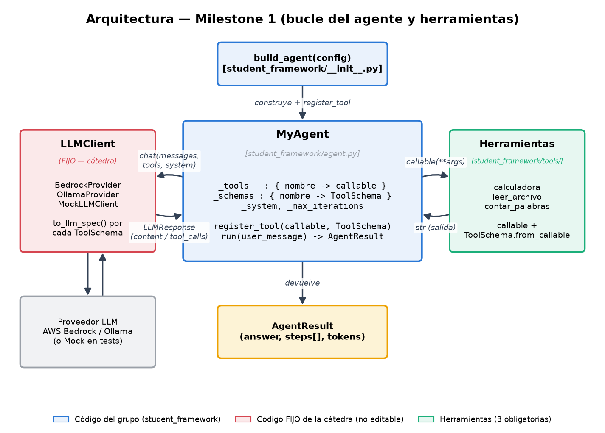
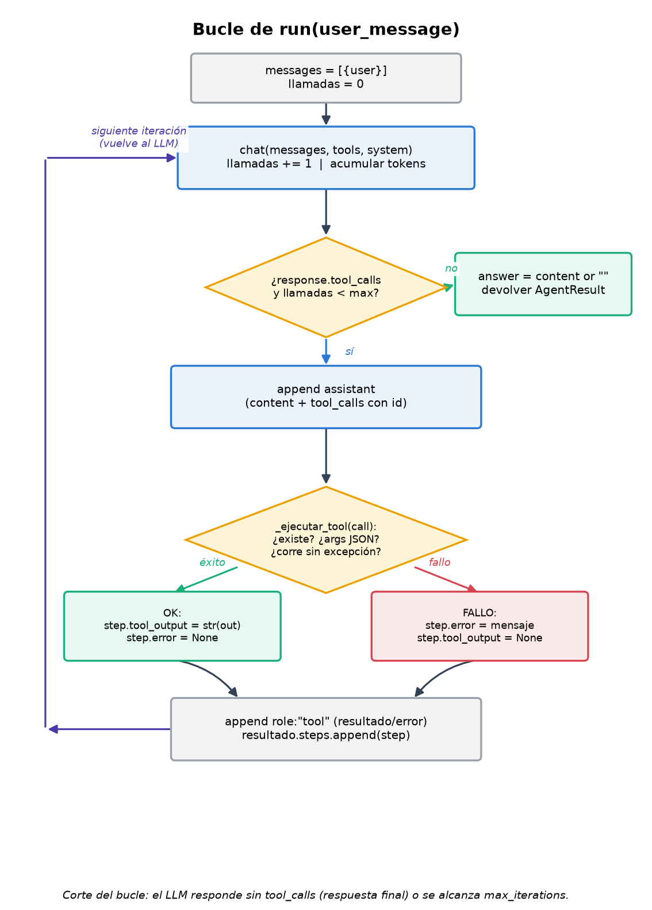

## Informe M1

Construimos un agente que registra herramientas, se las ofrece al LLM, ejecuta
las que el modelo pide, mira los resultados y sigue hasta dar una respuesta
final, sin quedarse trabado en un bucle infinito. Acá las herramientas son
genéricas (calculadora, lector de archivos, contador de palabras), pero es el
mismo mecanismo con el que el agente después juega la sala de escape en M3:
registrar verbos y dejar que el LLM los use dentro del bucle. M1 construye ese
motor; el juego y su evaluación llegan en M3, y ahí aparece también el punto
débil del mecanismo: con modelos chicos, el modo de fallo más común no es de
razonamiento sino que el modelo describe la acción en texto en vez de emitir
la llamada a la herramienta, una falla que nace justo en este milestone.

Al momento de entregar M1 pasaban los 5 tests de conformidad, los 5 escenarios
que armamos nosotros y 23 tests de las herramientas: todo en verde (ese
archivo de tests de herramientas después creció en M2, hoy tiene 26, cuando el
lector de archivos sumó el sandbox).

### Componentes

build_agent(config) es el único punto de entrada: arma el agente, le pone un
LLMClient (el del config, o uno armado desde variables de entorno) y registra
las tres herramientas obligatorias. Por acá entran tanto la CLI como los tests
de conformidad.

MyAgent es la pieza central: guarda dos diccionarios en paralelo (nombre a
función, nombre a schema) y expone register_tool y run. El LLMClient abstrae
el proveedor (Bedrock, Ollama, o el mock de los tests): recibe el schema de
cada herramienta y lo traduce al formato de cada proveedor, y el agente nunca
habla directamente con ninguno de los dos, siempre pasa por acá, como pide el
enunciado. Cada herramienta vive en su propio archivo dentro de tools, con su
función y su schema.

Con esto el agente solo intercambia mensajes y respuestas ya normalizadas con
el LLMClient, sin saber nada del formato de cada proveedor. Por eso los tests
pueden reemplazar el cliente real por uno simulado sin tocar el agente.

### Cómo armamos una herramienta

Cada herramienta es una función tipada. Lo que ve el LLM como descripción sale
del docstring de la función, y la descripción de cada argumento sale de las
anotaciones de tipo. Ese schema se genera solo a partir de la firma de la
función (con Pydantic), nunca lo escribimos a mano, como pide el enunciado. La
description es lo que el modelo lee para decidir cuándo y cómo usar la
herramienta, así que tratamos el docstring como documentación pública hacia
el LLM, no como un comentario interno.

El agente le manda al LLM la lista de schemas en cada turno de la
conversación, no solo en el primero, para que el modelo pueda usar una
herramienta en cualquier momento. Cuando el modelo decide usar una, el cliente
normaliza la respuesta para que el agente sepa qué función ejecutar y con qué
argumentos.

### Las tres herramientas obligatorias

Calculadora: recibe dos números y un operador por separado, no una expresión
como texto, porque el enunciado prohíbe usar eval sobre expresiones
arbitrarias (una versión anterior parseaba un string con ast.parse, pero eso
termina siendo lo mismo, así que la sacamos). Soporta suma, resta,
multiplicación, división y módulo, porque circulan dos versiones del
enunciado que piden operadores distintos. División o módulo por cero
devuelven un mensaje de error en vez de romper.

Lector de archivos: recibe una ruta y devuelve el contenido de un archivo de
texto. Antes de leer valida que exista y que no sea un directorio, y pone un
tope de 100 KB para no mandar un archivo gigante al LLM. Si no es texto o hay
un problema de permisos, devuelve el error como texto en vez de tirar una
excepción.

Contador de palabras (nuestra herramienta libre): recibe un texto y devuelve
cuántas palabras tiene, usando el split de Python. La elegimos porque combina
bien con el lector de archivos: leer un archivo y contar sus palabras es el
ejemplo que usamos para probar que el agente puede encadenar dos
herramientas.

### El bucle del agente

El bucle sigue mientras la respuesta del LLM pida usar una herramienta.
Apenas contesta con texto y sin pedir ninguna más, ese texto es la respuesta
final y el bucle corta, que es la condición del enunciado. Para que no se
cuelgue si el modelo pide herramientas sin parar, contamos cada llamada al
LLM y cortamos al llegar a un tope (20 por defecto; el runner de M3 lo sube a
30); en ese caso el agente igual devuelve una respuesta válida con los pasos
que llegó a hacer, nunca tira una excepción (test_escenario_corte_por_max_iterations).

Invariantes que pide el enunciado y cómo los cumplimos:

| Qué pide | Cómo lo resolvimos |
|---|---|
| Sin herramientas, una sola llamada al LLM | el bucle no arranca si no hay llamada a herramienta |
| Sin herramientas, no quedan pasos guardados | los pasos se guardan solo dentro del bucle |
| Un paso por cada herramienta usada | se guarda uno por cada llamada |
| La segunda llamada al LLM incluye el resultado de la herramienta | se agrega ese resultado como mensaje antes de volver a llamar |
| El resultado guardado es el que devolvió la función, sin tocarlo | se guarda tal cual, como texto |
| No queda error si la ejecución salió bien | solo se marca error si algo realmente falló |
| Una herramienta que no existe no rompe nada | se detecta antes de intentar ejecutarla |
| No tira excepción con "hola", "2+2" o vacío | sin herramientas ni entra al bucle; con herramientas, todo queda capturado |

### Algunas decisiones que tomamos

El corte del bucle depende de si vino una llamada a herramienta, no de si
falta texto (antes cortábamos si el texto venía vacío, pero eso falla cuando
el modelo manda texto y una llamada a herramienta juntos). El tope de
iteraciones cuenta llamadas al LLM, no herramientas ejecutadas, porque el
enunciado habla de dejar de llamar al LLM al llegar a esa cantidad.

El agente nunca tira una excepción: toda la ejecución de una herramienta pasa
por una función que agarra los tres fallos posibles (herramienta inexistente,
JSON roto, excepción de la función) y los devuelve como error. Cuando una
herramienta falla, el error también se le manda al LLM como parte de la
conversación, para que pueda corregirse en el siguiente turno
(test_escenario_recuperacion_ante_tool_desconocida).

Cada llamada a herramienta lleva un id que se repite en la respuesta. Con el
mock no cambia nada, pero Bedrock lo exige: sin el id la conversación real se
rompe. Los tokens de entrada y salida quedan en None hasta que algún
proveedor los reporta (antes teníamos un bug acá: se inicializaban en 0 y una
condición mal puesta hacía que nunca se sumaran).

Una herramienta cuenta como exitosa si la función no tiró una excepción,
aunque el texto que devuelva empiece con "Error:". No es lo mismo un mensaje
de error que la herramienta decide devolver que un fallo real de ejecución
(antes usábamos ese prefijo como heurística, pero era poco confiable).

El prompt de sistema por defecto es genérico y no obliga a usar herramientas,
para no romper el caso de un saludo simple; build_agent permite pasar otro
prompt por configuración, así cada milestone puede especializarlo sin tocar
el agente (en M3, el runner de la sala de escape inyecta el suyo por esta
vía).

### Manejo de errores

Una sola función centraliza los tres tipos de fallo al ejecutar una
herramienta:

| Caso | Resultado |
|---|---|
| Herramienta que no existe | error, "herramienta desconocida" |
| Argumentos con JSON inválido | error, "argumentos inválidos" |
| Excepción de la herramienta | error, con el mensaje de la excepción |
| Ejecución exitosa | el texto que devolvió la función |

Además cada herramienta maneja sus propios errores de dominio (operador
inválido, división por cero, archivo inexistente o binario) devolviendo un
texto en vez de romper. La idea de fondo es tratar los errores como parte
normal de la conversación: se le muestran al modelo como un resultado más, y
puede leerlos y reaccionar en el siguiente turno. Así una herramienta rota no
tira abajo todo el agente.

### Cómo probamos

Probamos en tres niveles. Los tests de conformidad (fijos por el enunciado)
verifican el contrato mínimo con el mock. Los cinco escenarios propios
prueban el bucle completo: encadenar lector y contador, usar calculadora y
contador juntos, recuperarse cuando el LLM pide una herramienta inexistente,
cortar bien cuando nunca deja de pedir herramientas, y probar la división.
Los tests unitarios (23 en ese momento, hoy 26) prueban cada herramienta
sola, con los casos borde que los escenarios no cubren: los cinco operadores
y sus divisiones por cero, archivo inexistente, ruta que es un directorio,
archivo binario, archivo grande, y distintas variantes de texto para el
contador.

### Del enunciado a la implementación

| Pide el enunciado | Dónde está |
|---|---|
| build_agent devuelve un agente | student_framework/__init__.py |
| Usa el llm_client del config o uno del entorno | __init__.py |
| register_tool | agent.py |
| Mandar las herramientas en cada turno, no solo el primero | agent.py, run |
| Las tres herramientas obligatorias | tools/calculator.py, file_reader.py, word_counter.py |
| Schema generado solo, sin JSON a mano | al final de cada archivo de herramienta |
| Bucle de razonar, ejecutar, observar y seguir | agent.py, run |
| Cortar sin herramientas o por tope de iteraciones | agent.py, run |
| Un paso por herramienta, con su resultado o error | agent.py, run |
| Herramienta desconocida no rompe nada | función de ejecución de herramientas |
| No tira excepción con entradas básicas | bucle y ejecución de herramientas |
| Escenarios con dos o más herramientas | tests/test_escenarios_propios.py |

### Lo que le falta

El agente no tiene memoria entre llamadas a run (queda para M2). La salida
estructurada todavía no está, el método tira directamente un error de "no
implementado", y si falla la llamada al LLM por algo transitorio no
reintenta. La calculadora solo hace una operación entre dos números, sin
paréntesis ni potencias, y el lector solo admite texto de hasta 100 KB.
Asumimos que un turno sin llamada a herramienta ya es la respuesta final; si
algún modelo mandara texto y una llamada juntos, priorizamos la herramienta y
seguimos. Los tokens solo aparecen si el proveedor los reporta.

### Pruebas reales

Además de los tests con el mock, corrimos el agente contra modelos reales
para ver que funcione de punta a punta. Con Ollama (qwen2.5:3b), le pedimos
resolver 17 por 23 con la calculadora y funcionó bien, y después encadenar
leer un archivo y contar sus palabras: con una instrucción explícita
encadenó las dos herramientas y llegó al número correcto. Notamos que con un
modelo chico, si la instrucción es vaga (por ejemplo "leé y contá") a veces
no llama a la segunda herramienta y cuenta él mismo, mal, pero con
instrucción explícita anda bien; y ante una ruta larga escrita mal, la
herramienta devolvió que el archivo no existe y el agente lo mostró sin
romperse.

Con AWS Bedrock (nova-lite) probamos las tres herramientas y anduvieron
bien, sin cambiar una línea del agente. Notamos dos cosas propias de este
modelo: en una corrida devolvió una llamada como texto plano en vez de usar
el mecanismo normal de tool use (no se repitió en tres intentos más, así que
parece puntual), y a veces mezcla su razonamiento interno dentro de la
respuesta, algo cosmético que no pasaba con Ollama.

Con estas dos pruebas confirmamos que el mismo agente corre sin cambios
contra un proveedor local y uno en la nube, que es lo que buscábamos validar
con el LLMClient.