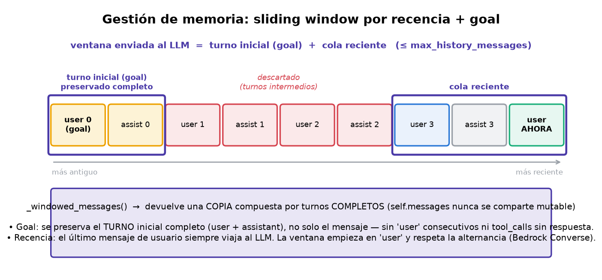
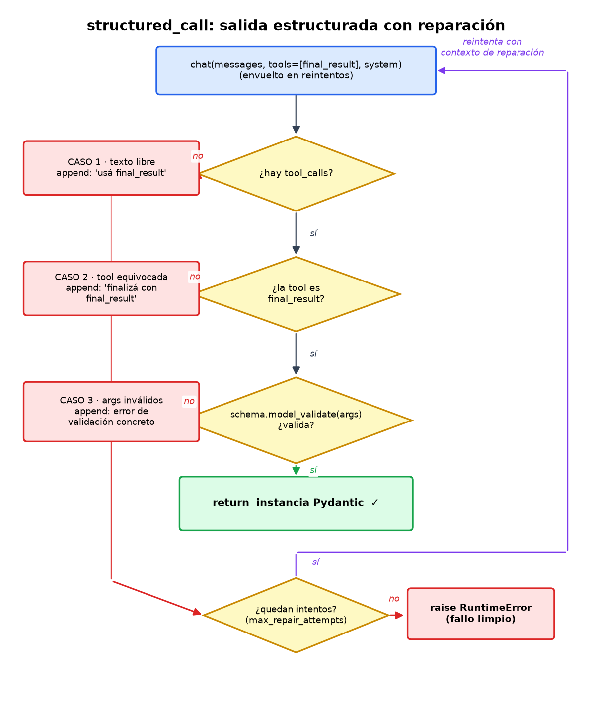
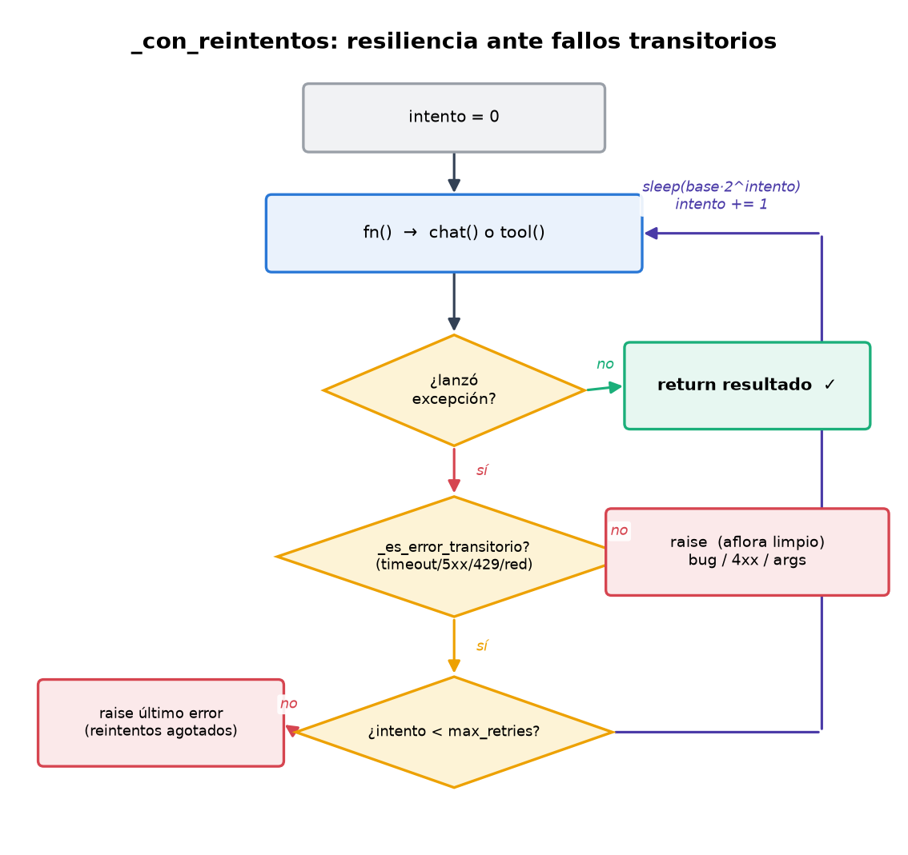

# Informe — Milestone 2: Memoria, prompting y robustez

> **Serie — el hilo del escape room.** Tres milestones hacia un agente que
> **juega y se evalúa en una sala de escape** (*gamification* como banco de
> pruebas): [M1](INFORME_M1.md) ▸ el agente y sus herramientas · **M2 ▸ memoria
> y robustez** · [M3](INFORME_M3.md) ▸ evaluación en el juego. Índice:
> [INFORMES.md](INFORMES.md).

## 1. Resumen de la entrega

M2 amplía el agente de M1 para que sobreviva a **conversaciones largas**,
**salidas malformadas** del modelo y **fallos transitorios**, sin cambiar la
fachada externa (`build_agent`, `register_tool`, `run`). Esas tres capacidades no
son abstractas: son **exactamente** lo que la sala de escape de M3 va a exigir —un
mundo *estado-full* donde hay que recordar el mapa y volver, modelos chicos que a
veces devuelven prosa en vez de tool-calls, y trayectorias largas de muchos
pasos—. M2 le da al agente lo que necesita para jugar; M3 lo pone a jugar.

Toda la lógica nueva vive **en el agente** (`student_framework/agent.py`) y en las
**herramientas** (`student_framework/tools/`); el cliente LLM
(`mia_agents/llm_client.py`) sigue intacto, tal como exige la consigna para poder
correr los tests con `MockLLMClient`.

Lo implementado:

- **Estado conversacional** entre llamadas a `run`.
- **Gestión de memoria** con *sliding window* por recencia, respetando
  `max_history_messages` y la invariante de recencia.
- **Salida estructurada** (`structured_call`) con la tool sintética
  `final_result`, validación Pydantic y reparación.
- **Resiliencia**: reintentos con backoff exponencial ante fallos transitorios,
  aplicados tanto a las llamadas al LLM como a las herramientas.
- **Errores recuperables accionables** en la calculadora y el lector de archivos.
- **Tracking de tokens** acumulado por `run`.

**Estado de los tests:** toda la suite local pasa — **98 tests en verde**
(excluyendo M3, que requiere el paquete `mia_world`, no presente en el repo). De
esos 98, **21 son de M2**: 7 de conformidad (`tests/conformance/test_m2.py`) + 14
propios (`tests/test_m2_propios.py`). Si se excluyen los **33 tests de los
proveedores LLM** (`test_ollama_provider` + `test_bedrock_provider`, que validan
el cliente fijo `mia_agents/llm_client.py`, no código de M2), quedan **65 tests**
de nuestro código + el contrato de conformidad.

```bash
# Toda la suite local (98): excluye solo M3
pytest -q --ignore=tests/conformance/test_m3_world.py
# 98 passed

# Solo el código propio (65): sin M3 ni tests de proveedores
pytest -q --ignore=tests/conformance/test_m3_world.py \
  --ignore=tests/test_ollama_provider.py --ignore=tests/test_bedrock_provider.py
# 65 passed
```

**Archivos nuevos/modificados respecto de M1:**

| Archivo | Cambio en M2 |
|---|---|
| `student_framework/agent.py` | Statefulness, `_windowed_messages`, `_con_reintentos`, `structured_call`, tracking de tokens |
| `student_framework/__init__.py` | `build_agent` acepta `max_history_messages`, `max_retries`, `retry_backoff_base` |
| `student_framework/tools/calculator.py` | Errores recuperables con mensajes accionables |
| `student_framework/tools/file_reader.py` | Sandbox configurable + validación de rutas + listado de archivos disponibles |
| `tests/test_m2_propios.py` | 13 tests propios de M2 (resiliencia, recencia, reparación, recuperación) |

---

## 2. Estado conversacional (statefulness)

El agente mantiene el historial en `self.messages`, inicializado una sola vez en
el constructor ([agent.py:122](student_framework/agent.py#L122)). Cada llamada a
`run(...)`:

1. Anexa el mensaje del usuario al historial.
2. Ejecuta el bucle de tool-calling (idéntico en forma al de M1).
3. Anexa la respuesta final del `assistant`.

Como el historial **no** se reinicia entre llamadas, `run` sucesivos continúan la
misma conversación. El turno de `assistant` final se guarda **sin** `tool_calls`
([agent.py:241-246](student_framework/agent.py#L241)) para no dejar `tool_calls`
huérfanos (sin su mensaje `tool` de respuesta) en el historial cuando el bucle
corta por `max_iterations`.

---

## 3. Estrategia de memoria



> Los tres diagramas de este informe se generan con
> `python scripts/generar_diagramas_m2.py` (requiere matplotlib).

### 3.1 Cómo está implementada

La estrategia obligatoria es **sliding window por recencia**, en
`_windowed_messages()` ([agent.py:619](student_framework/agent.py#L619)). En
cada llamada al LLM se construye una **copia recortada** del historial:

- Si `len(self.messages) <= max_history_messages`, se envía tal cual.
- Si lo supera, se conserva el **turno inicial completo** (el goal: el primer
  mensaje de usuario **y su respuesta del asistente**) más los **turnos
  recientes**, descartando los intermedios. La ventana se compone de turnos
  completos (patrón `preserve_first_user` visto en clase, extendido al turno
  entero).

**Detalle clave (bug corregido):** `_windowed_messages` devuelve una **lista
nueva**, nunca el objeto `self.messages`. Una versión anterior aplicaba la
ventana sobre la lista interna y la pasaba por referencia al cliente; como el
`MockLLMClient` guarda la referencia recibida, el historial parecía crecer más
allá del presupuesto (se veía el estado final, no el del momento de la llamada).
Trabajar sobre una copia elimina ese acoplamiento y hace que el tope se respete
en **cada** llamada.

### 3.2 Invariante de recencia

Cualquiera sea el recorte, **el mensaje de usuario más reciente siempre viaja al
LLM**. Si el turno actual (por ejemplo, con muchos `tool` intermedios) es más
largo que el presupuesto y la cola no contiene ningún mensaje `user`, se **fuerza**
la inclusión del último mensaje de usuario al frente de la ventana
([agent.py:619](student_framework/agent.py#L619)). Cubierto por
`test_ultimo_mensaje_de_usuario_siempre_presente`.

El **turno inicial completo (el goal)** también se conserva cuando el historial
supera el presupuesto. Preservamos el primer mensaje de usuario **junto con su
respuesta del asistente** (no solo el mensaje suelto): esto evita dejar dos `user`
consecutivos o un `tool_call` sin su respuesta en la ventana, y respeta la
**alternancia de roles** que exige Bedrock Converse. Mantener el goal evita, además,
que el agente "olvide" la tarea en conversaciones largas (patrón `preserve_first_user`
de la Clase 4, extendido al turno entero). La recencia tiene prioridad: si el turno
inicial fuera tan grande que no dejara lugar, cede para garantizar el último `user`.
Cubierto por `test_primer_turno_goal_se_conserva`, que además verifica que no queden
dos turnos de usuario pegados.

Además, la ventana **siempre empieza en un mensaje `user`**: se descartan del
frente los `tool`/`assistant` que hayan quedado sin su turno completo. Esto evita
mandar `tool_calls` sin contexto a proveedores estrictos como Bedrock Converse.

### 3.3 Justificación y tradeoffs

Elegimos recencia **más preservación del goal** porque en una conversación el
contexto útil se concentra en los últimos turnos, pero el objetivo inicial debe
seguir presente para no perder el rumbo. Los turnos **intermedios** son los de
menor valor esperado y son los que sacrificamos al quedarnos sin presupuesto.
Ventajas: simple, determinista y O(n).

Acotar el historial no es solo por costo o por el límite duro de la ventana:
**más contexto no es mejor contexto**. Dos resultados lo respaldan: *Lost in the
Middle* (Liu et al., 2023) muestra que la atención degrada con la posición —los
datos en el medio de un contexto largo se "pierden"—, y *Context Rot*
(Jaroslawicz et al., 2025) que llenar la ventana diluye la atención aunque todo
"entre". Una ventana de recencia mantiene el contexto chico y fresco, que es
donde el modelo rinde mejor. Tradeoffs asumidos **deliberadamente**:

- **No hay summarization ni offload/retrieve.** Si el usuario referencia algo
  dicho muy atrás y ese turno ya salió de la ventana, esa información se pierde.
  Una estrategia de resumen conservaría más señal a costa de más llamadas al LLM
  y más complejidad; para el alcance de M2 no lo justificamos.
- **El estado vive en memoria del proceso**: no hay persistencia entre
  ejecuciones.
- **Anclar el primer turno es una heurística**, no una verdad universal.
  Asume que el objetivo inicial se mantiene vigente durante toda la conversación
  (`preserve_first_user`, Clase 4), lo cual es razonable en tareas de agente con
  una meta estable. Si la conversación cambia de objetivo a mitad de camino,
  seguimos gastando presupuesto en un goal que ya no aplica; una estrategia más
  sofisticada detectaría el goal vigente en lugar de fijar el primero. Para el
  alcance de M2 lo asumimos deliberadamente como default simple y defendible.

Verificamos que conversaciones largas siguen respondiendo con `answer` no vacío
en `test_conversacion_larga_sigue_respondiendo`.

### 3.4 Problemas encontrados

Cuatro problemas concretos que surgieron al implementar la ventana:

1. **Copia vs. referencia** (el que hacía fallar el test de cota). Aplicar la
   ventana sobre `self.messages` y pasarla por referencia hacía que el
   `MockLLMClient` viera el estado final, no el del momento de la llamada; el
   historial parecía superar el presupuesto. Lo resolvimos devolviendo una copia
   (§3.1).
2. **Cola sin mensaje de usuario.** Con un turno actual más largo que el
   presupuesto, la cola recortada podía no contener ningún `user` y romper la
   recencia. Lo resolvimos forzando el último `user` (§3.2).
3. **Ventana con `tool`/`assistant` huérfanos.** Recortar "a ciegas" dejaba
   ventanas que empezaban con un `tool` sin su `toolUse`. Con el mock no molesta,
   pero Bedrock rechaza un `toolResult` sin su `toolUse`; por eso descartamos del
   frente hasta que el primer mensaje sea `user`.
4. **`tool_calls` huérfanos al cortar por `max_iterations`.** Si el bucle cortaba
   con tool calls pendientes, se guardaba el turno `assistant` con esos
   `tool_calls` sin su respuesta `tool`. Ahora persistimos el último turno **sin**
   `tool_calls` para no dejar huérfanos en el historial.

### 3.5 Extensión en M3: tareas de un solo turno

> Esta sección documenta un cambio **posterior** a la entrega de M2. El resto
> del informe describe M2 tal como se entregó; los conteos de tests de la §1 y
> la §8 corresponden a ese momento.

La estrategia descrita arriba desliza sobre **turnos**, y un turno se delimita
por los mensajes `user`. Eso es correcto mientras el agente sea conversacional,
que es el supuesto de M2: cada `run()` agrega un `user`.

En M3 ese supuesto no vale. El agente resuelve el escenario entero dentro de
**un solo `run()`**, así que hay un único mensaje `user` (el goal) y después
solo bloques `assistant(tool_calls)` + sus `tool`. Sin un segundo `user`, el
"turno inicial completo" se comía el historial entero, el presupuesto restante
quedaba negativo y el fallback descartaba todo lo que no fuera `user`: la
ventana **colapsaba al goal pelado** y el agente perdía toda la exploración a
mitad de partida. Con los defaults del eval (50 mensajes, 30 iteraciones) el
colapso ocurría en la llamada 26 y ya no se recuperaba — justo en los
escenarios `hard`/`extreme`, que son los que necesitan 13-21 tool-calls.

La corrección agrega una rama para ese caso
([`_ventana_de_un_solo_turno`](student_framework/agent.py#L743)): cuando hay un
único `user`, la ventana desliza sobre **bloques de acción** en lugar de turnos.
Un bloque es un `assistant` junto con los `tool` que responden a sus
`tool_calls` ([`_bloques_de_accion`](student_framework/agent.py#L727)); es la
unidad que no se puede partir sin dejar un `tool_call` sin respuesta. Se
conserva el goal como ancla y se agregan los bloques más recientes que entren
en el presupuesto.

Los invariantes de §3.2 se mantienen: la ventana empieza en `user`, no supera
el presupuesto, no deja huérfanos y, una vez normalizada a Bedrock Converse,
alterna roles correctamente (los `tool` se normalizan a `user`, así que la
secuencia queda `user`, y después pares `assistant`/`user`).

El camino multiturno de M1/M2 no cambió. La regresión está cubierta por
`tests/test_m3_ventana.py`.

---

## 4. Salida estructurada (`structured_call`)

`structured_call(prompt, schema, max_repair_attempts=2)`
([agent.py:379-525](student_framework/agent.py#L379)) obliga al LLM a responder
con un objeto validado contra un schema de Pydantic.

**Decisión de diseño: es un método aparte, no un paso del loop ReAct.** El bucle
de `run()` es sense→decide→act y corta cuando el modelo decide que terminó (o al
llegar a `max_iterations`); `structured_call` tiene otra condición de corte —un
`tool_call` a `final_result` cuyos argumentos **validan** contra el schema— y su
propio loop de **reparación** acotado por `max_repair_attempts`. Además expone
**solo** la tool `final_result` (no las herramientas registradas) y trabaja sobre
un historial `messages` **local y fresco**, sin tocar `self.messages`: es una
extracción estructurada one-shot, stateless respecto de la conversación del
agente. Mantenerlo separado evita mezclar dos criterios de terminación distintos
y preserva la garantía de formato. Lo que **sí** comparte con el loop es la capa
de resiliencia (`self._con_reintentos`, §5): control-flow separado, primitivas de
robustez compartidas.

### 4.1 Cómo se ofrece `final_result`

En cada intento se pasa **únicamente** la tool sintética
`final_result_tool_schema(schema)` (nombre fijo `FINAL_RESULT_TOOL_NAME`) como
`tools=[tool]` ([agent.py:417-423](student_framework/agent.py#L417)). No se
exponen las demás herramientas: el objetivo es forzar la salida estructurada, no
resolver una tarea.



### 4.2 Validación y reparación

Se contemplan tres modos de fallo, y cada uno agrega contexto de reparación y
reintenta:

1. **Texto libre** (el modelo no invoca ninguna tool): se le recuerda que debe
   usar `final_result` ([agent.py:426-443](student_framework/agent.py#L426)).
2. **Tool equivocada** (invoca otra distinta de `final_result`): se le pide
   finalizar con `final_result` ([agent.py:455-483](student_framework/agent.py#L455)).
3. **Argumentos inválidos** (`schema.model_validate(...)` lanza): se le devuelve
   el error concreto de validación para que corrija
   ([agent.py:486-523](student_framework/agent.py#L486)).

La llamada termina en cuanto un `tool_call` a `final_result` valida contra el
schema, devolviendo la instancia Pydantic.

### 4.3 Fallo cuando se agotan los reintentos

Tras `max_repair_attempts` reparaciones sin éxito se levanta
`RuntimeError("No se pudo obtener una respuesta estructurada valida")`
([agent.py:525](student_framework/agent.py#L525)). **Nunca** se devuelve `None`
ni una instancia parcial. Cubierto por los tests de conformidad
`test_structured_output_max_retries` y
`test_structured_output_repairs_schema_validation_error`, y por el escenario
propio `test_prompt_roto_dispara_reparacion_y_se_recupera`.

---

## 5. Resiliencia (reintentos ante fallos transitorios)



### 5.1 Clasificación de errores

`_es_error_transitorio(exc)` ([agent.py:52-62](student_framework/agent.py#L52))
decide qué se reintenta:

- `TimeoutError` y `ConnectionError` por tipo.
- Marcadores en el nombre/mensaje de la excepción (case-insensitive):
  `timeout`, `throttl`, `rate limit`, `429`, `500/502/503/504`,
  `service unavailable`, `connection`, `temporarily`, etc.
  ([agent.py:31-49](student_framework/agent.py#L31)).

Cualquier otro error (bug, argumentos inválidos, 4xx que no sea rate limit)
**aflora limpio, sin reintentos**.

### 5.2 Mecanismo

`_con_reintentos(fn)` ([agent.py:309-328](student_framework/agent.py#L309))
ejecuta `fn` y, ante un error transitorio, reintenta hasta `max_retries` con
**backoff exponencial** `retry_backoff_base * 2**intento`. Se usa en dos lugares:

- **Llamadas al LLM**, vía `_chat_con_reintentos`
  ([agent.py:252-261](student_framework/agent.py#L252)) — que además aplica la
  ventana de memoria.
- **Ejecución de herramientas** ([agent.py:358](student_framework/agent.py#L358)),
  por si una tool hace red y sufre un timeout.

Ambos parámetros se pueden configurar desde `build_agent`
(`max_retries`, `retry_backoff_base`); poner `retry_backoff_base=0` desactiva los
sleeps en los tests.

### 5.3 Cobertura de pruebas

La resiliencia está verificada por tests propios que simulan cada tipo de fallo
y comprueban el comportamiento esperado: que los transitorios se reintenten y la
ejecución termine bien, y que los no transitorios afloren sin reintento. Los
tests que la cubren:

- `test_timeout_del_llm_se_reintenta_y_termina_bien` — un timeout se reintenta y `run` tiene éxito.
- `test_throttling_del_llm_se_reintenta` — un rate limit (429) / 5xx se reintenta.
- `test_error_no_transitorio_no_se_reintenta` — un error de programación aflora limpio, sin reintentos.
- `test_reintentos_agotados_propagan_el_error` — si el fallo persiste, tras agotar los reintentos se propaga.
- `test_tool_con_fallo_transitorio_se_reintenta` — una herramienta que falla una vez con timeout se reintenta.

---

## 6. Errores recuperables en las herramientas

La idea no es solo "no crashear", sino distinguir los fallos **recuperables** (el
LLM puede corregir los argumentos y reintentar) y devolver un mensaje
**accionable**.

El principio de fondo es **errores como observaciones**: un error de herramienta
no rompe el bucle, vuelve al agente como un `tool` message más y el modelo lee ese
mensaje en la iteración siguiente para corregir por su cuenta. Un mensaje
accionable (qué falló, por qué, cómo debería verse la entrada válida) es lo que
habilita esa **autocorrección**; un `"Error"` genérico no. Los dos ejemplos de
abajo son exactamente ese comportamiento.

### 6.1 Calculadora ([calculator.py](student_framework/tools/calculator.py))

| Error recuperable | Qué devuelve |
|---|---|
| **Operando no numérico** | Indica qué parámetro falló, qué valor (`repr`) y tipo recibió, y cómo debe verse uno válido. Si llega un string numérico (`"42"`, `"2.5"`) lo **convierte** en vez de fallar. |
| **Operador no soportado** | Lista los permitidos: `+`, `-`, `*`, `/`, `%`. |
| **División/módulo por cero** | Explica la restricción concreta y sugiere reintentar con `operando_b ≠ 0`. |

**Ejemplo concreto de recuperación** (`test_recuperacion_de_error_en_calculadora_via_agente`):
el LLM llama `calculadora(operando_b=0, operador="/")`, la tool devuelve
*"Error: la división no está definida cuando el segundo operando es 0…"*, y en el
siguiente turno el modelo corrige el operando y obtiene el resultado.

> Nota: sostenemos los cinco operadores (`+ - * / %`) para cubrir las dos
> variantes del enunciado (una menciona `/`, otra `%`). El mensaje de error
> siempre lista el conjunto realmente soportado.

### 6.2 Lector de archivos ([file_reader.py](student_framework/tools/file_reader.py))

Opera dentro de un **sandbox**: todas las rutas son **relativas** a un directorio
raíz (`set_sandbox_root` / `get_sandbox_root`,
[file_reader.py:34-42](student_framework/tools/file_reader.py#L34)).

| Error recuperable | Qué devuelve |
|---|---|
| **Ruta vacía** | Pide una ruta relativa, con ejemplo. |
| **Ruta absoluta** | Explica que solo se aceptan rutas relativas al sandbox. |
| **Ruta con `..`** | Explica que `..` permite escapar del sandbox y está prohibido. |
| **Escape vía symlink** | Resuelve la ruta y la rechaza si cae fuera de la raíz. |
| **Archivo inexistente** | Si el directorio contenedor existe, **lista los archivos disponibles** ahí para que el LLM elija bien. |
| **La ruta es un directorio** | Lo indica y **lista el contenido** del directorio. |

Además conserva las defensas de M1: tope de tamaño (`_MAX_BYTES`), `UnicodeDecodeError`
(no es texto UTF-8) y `OSError` (permisos).

**Ejemplo concreto de recuperación:** el LLM pide `leer_archivo("informe.txt")`;
como no existe, la tool responde *"Error: el archivo 'informe.txt' no existe.
Archivos disponibles en '.': notas.txt, datos/. Elegí uno de esos nombres."*, y
el modelo reintenta con `notas.txt`. El escape de sandbox está cubierto por
`test_lector_escape_del_sandbox_via_subdirectorio`.

---

## 7. Tracking de tokens

`_acumular_tokens` ([agent.py:363-377](student_framework/agent.py#L363)) suma
`input_tokens`/`output_tokens` de cada `LLMResponse` a lo largo de un `run`. Los
contadores quedan en `None` mientras ningún response reporte tokens; en cuanto uno
lo hace, se inicializan en 0 y se acumulan, tratando los `None` por respuesta como
0. Cubierto por los tests de conformidad `test_token_accounting` y
`test_token_accounting_treats_missing_values_as_zero_after_first_report`.

Contar `input` y `output` por separado sirve para **estimar el costo** de cada
`run`: los proveedores cobran distinto por token de entrada y de salida (la salida
suele ser varias veces más cara), así que sumar ambos por separado es lo que
permite proyectar el gasto real de una conversación.

---

## 8. Estrategia de pruebas

- **Conformidad** (`tests/conformance/test_m2.py`, 7/7): statefulness, historial
  acotado, `final_result`, reparación, reintentos de reparación y tokens.
- **Propios** (`tests/test_m2_propios.py`, 14 casos): resiliencia (timeout,
  throttling, no-transitorio, reintentos agotados, tool transitoria), recencia,
  conversación larga, reparación de salida estructurada, y errores accionables de
  ambas herramientas (incluida una recuperación end-to-end vía el agente).

Todos usan `MockLLMClient` determinista (sin credenciales), por lo que corren en
cualquier máquina.

**Conteo de la suite (sin M3):**

| Grupo | Archivos | Tests |
|---|---|---|
| Conformidad M1 | `conformance/test_m1.py` | 5 |
| Conformidad M2 | `conformance/test_m2.py` | 7 |
| Herramientas | `test_herramientas.py` | 26 |
| Escenarios propios M1 | `test_escenarios_propios.py` | 5 |
| Propios M2 | `test_m2_propios.py` | 14 |
| Tool schema | `test_tool_schema.py` | 8 |
| **Subtotal (nuestro código + contrato)** | | **65** |
| Proveedores LLM (cliente fijo) | `test_ollama_provider.py` + `test_bedrock_provider.py` | 33 |
| **Total** | | **98** |

Reportamos **98** como "toda la suite local en verde"; **65** es el subconjunto
que ejercita nuestro código, excluyendo los **33 tests de proveedores** que
validan el cliente LLM fijo (fuera del alcance de M2).

---

## 9. Modos de fallo: dentro vs. fuera de alcance

Las defensas de M2 se ordenan según **dónde nace** cada modo de falla. Cada una
tiene su mecanismo, y todos los presentados en este informe caen en una de las
tres filas:

| Modo de falla | Dónde nace | Defensa (sección) |
|---|---|---|
| **Output malformado** | en el LLM | `structured_call` con `final_result` + validación Pydantic + reparación (§4) |
| **Tool que falla** | en el mundo externo | reintento ante transitorios + error accionable como observación (§5, §6) |
| **Contexto que crece** | en el historial, con el tiempo | sliding window con recencia + tracking de tokens (§3, §7) |

**Dentro de alcance (manejados):**
- Fallos transitorios del LLM y de tools (timeout, 5xx, rate limit) → reintento
  con backoff.
- Salida estructurada malformada (texto libre, tool equivocada, args inválidos)
  → reparación; si no converge, excepción limpia.
- Argumentos de herramienta inválidos/recuperables → mensaje accionable.
- Historial que supera el presupuesto → sliding window con recencia.

**Fuera de alcance (decisión explícita):**
- **Memoria por resumen/offload**: solo sliding window; el contexto muy antiguo se
  descarta sin resumir.
- **Persistencia del estado** entre procesos: el historial vive en memoria.
- **`structured_call` no usa el historial conversacional**: parte del `prompt`
  recibido, no de `self.messages` (es una utilidad de un solo turno).
- **Backoff bloqueante** (`time.sleep`), no asíncrono.
- **No hay prompt caching.** El cache de prefijo abarata las llamadas cuando el
  comienzo del prompt (`system` + tools + historial estable) no cambia entre
  turnos. Nuestra ventana de recencia **cambia el prefijo cada vez** (descarta lo
  viejo del frente), lo cual es *cache-unfriendly*: es una tensión de diseño
  conocida (recencia vs. estabilidad del prefijo) que no abordamos en M2.
- **Presupuesto en mensajes, no en tokens.** `max_history_messages` cuenta
  mensajes; un único mensaje enorme podría exceder el contexto real del modelo.
  Medir tokens exigiría un tokenizer por proveedor, fuera del alcance de M2.
- **Idempotencia de tools con efectos.** El reintento de herramientas asume que
  son seguras de re-ejecutar. Nuestras tres tools son puras o de solo lectura,
  pero una tool con efectos secundarios podría duplicarlos al reintentarse.

### 9.1 Decisión de diseño: clasificación de errores transitorios

`_es_error_transitorio` clasifica por **tipo de excepción** (`TimeoutError`,
`ConnectionError`) y por una **heurística de marcadores en el texto** del error
(`timeout`, `throttl`, `429`, `5xx`, `connection`, …). Elegimos esta vía a
propósito porque es **agnóstica del proveedor**: la misma lógica sirve para el
`MockLLMClient` de los tests, para Ollama y para Bedrock, sin acoplar el agente a
las excepciones concretas de ningún SDK. El costo asumido es que un proveedor con
una nomenclatura de error inusual podría no matchear ningún marcador y no
reintentarse.

Una mejora futura, si se priorizara robustez sobre portabilidad, sería inspeccionar
los **códigos estructurados** de cada proveedor (p. ej. `botocore.exceptions.ClientError`
expone `error_code` y el `HTTPStatusCode`), a costa de introducir dependencias
específicas del SDK en el agente.

---

## 10. Criterios de aprobación

- [x] Una conversación que supera el presupuesto de contexto sigue comportándose
      con sensatez (`test_conversacion_larga_sigue_respondiendo`).
- [x] Un prompt de salida estructurada roto dispara la reparación y se recupera o
      falla limpiamente (`test_prompt_roto_...`, `test_structured_output_*`).
- [x] Un fallo transitorio simulado se reintenta y termina con éxito
      (`test_timeout_del_llm_...`, `test_throttling_...`).
- [x] La calculadora y el lector devuelven mensajes claros y accionables ante
      errores recuperables (sección 6 y sus tests).
- [x] `AgentResult.input_tokens`/`output_tokens` reflejan lo reportado por el
      cliente LLM (`test_token_accounting*`).
- [x] Informe con las secciones descriptas (este documento).

---

## 11. Cómo ejecutar

```bash
# Tests (no requieren clave de API; usan MockLLMClient)
pytest tests/conformance/test_m2.py     # contrato M2 (cátedra)
pytest tests/test_m2_propios.py         # resiliencia, recencia, reparación
pytest tests/test_herramientas.py       # unitarios de las herramientas

# Toda la suite local (sin M3 ni tests de proveedor)
pytest -q --ignore=tests/conformance/test_m3_world.py \
  --ignore=tests/test_ollama_provider.py --ignore=tests/test_bedrock_provider.py

# Conversación multiturno contra un LLM real (ver README para el proveedor)
python -m mia_agents.cli run --module student_framework \
  --message "¿Cuánto es 17 * 23?"
```

---

## 12. Trazabilidad contrato → implementación

| Requisito (`ENUNCIADO_M2.md`) | Dónde se cumple | Test |
|---|---|---|
| Statefulness entre llamadas a `run` | `self.messages` persiste ([agent.py:122](student_framework/agent.py#L122)) | `test_agent_is_stateful_across_runs` |
| `chat(...)` nunca supera `max_history_messages` | `_windowed_messages` (§3) | `test_bounded_history_growth` |
| Mensaje de usuario más reciente siempre presente | `_windowed_messages` (inclusión forzada, §3.2) | `test_ultimo_mensaje_de_usuario_siempre_presente` |
| Turno inicial completo (goal) preservado | `_windowed_messages` (turnos completos, §3.2) | `test_primer_turno_goal_se_conserva` |
| Conversaciones largas sin romperse | sliding window + invariantes (§3) | `test_conversacion_larga_sigue_respondiendo` |
| `structured_call` ofrece `final_result` | `tools=[tool]` en cada `chat` (§4.1) | `test_structured_call_offers_final_result_tool` |
| Validación + reparación de salida estructurada | los 3 casos (§4.2) | `test_structured_output_repairs_schema_validation_error`, `test_prompt_roto_dispara_reparacion_y_se_recupera` |
| Fallo limpio al agotar reintentos | `raise RuntimeError` (§4.3) | `test_structured_output_max_retries` |
| Errores recuperables: calculadora | `tools/calculator.py` (§6.1) | `test_calculadora_*` |
| Errores recuperables: lector | `tools/file_reader.py` (§6.2) | `test_lector_escape_del_sandbox_via_subdirectorio` |
| Fallo transitorio reintentado con éxito | `_con_reintentos` (§5) | `test_timeout_del_llm_se_reintenta_y_termina_bien` |
| Tokens acumulados según el contrato | `_acumular_tokens` (§7) | `test_token_accounting*` |
| Informe con las secciones pedidas | este documento | — |
