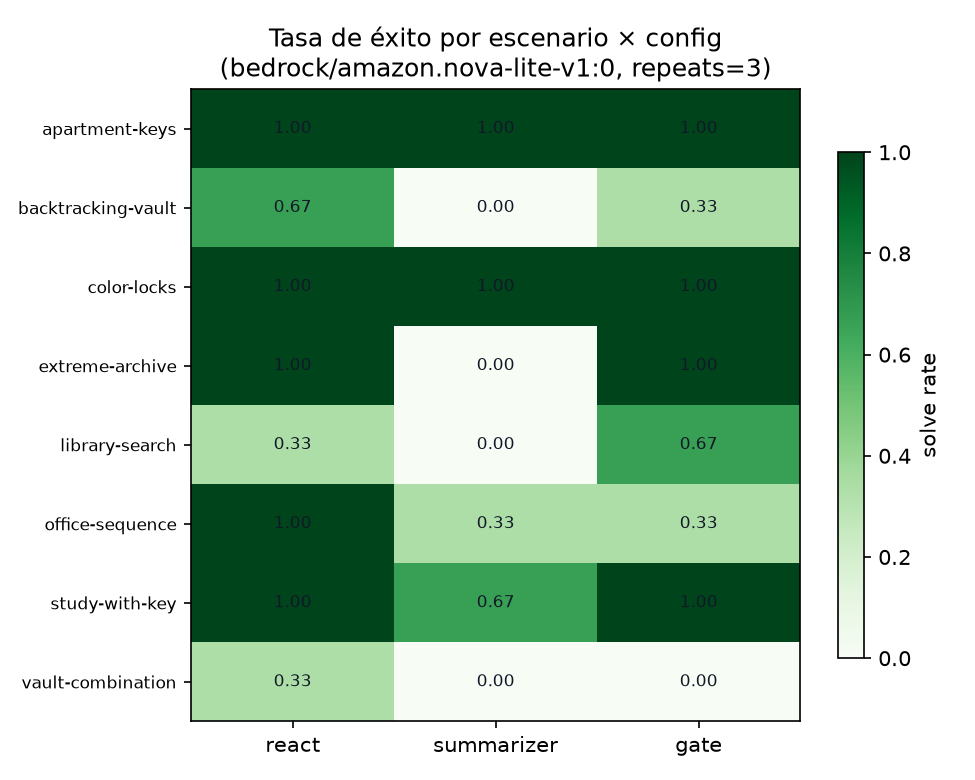
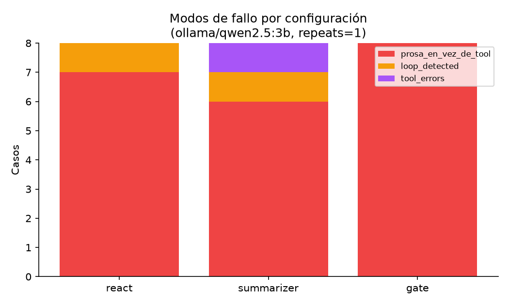
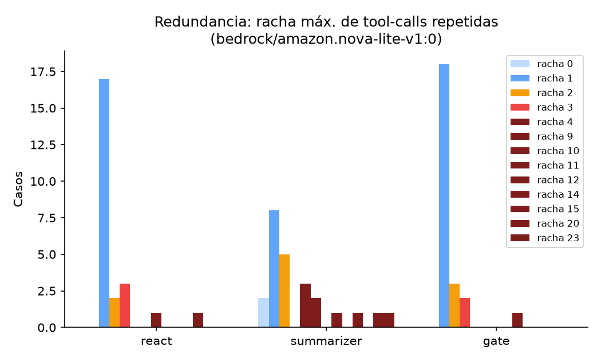
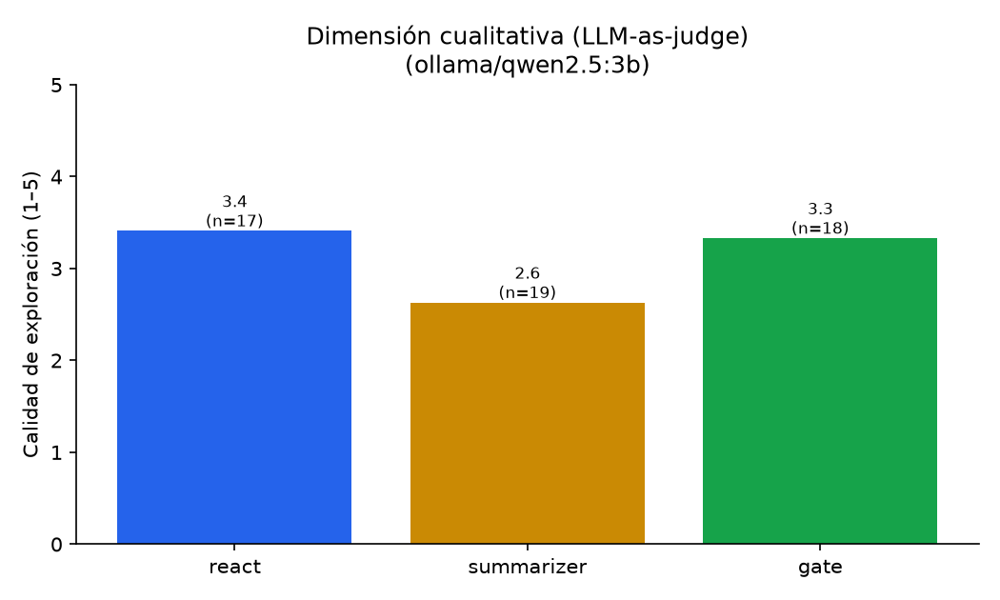
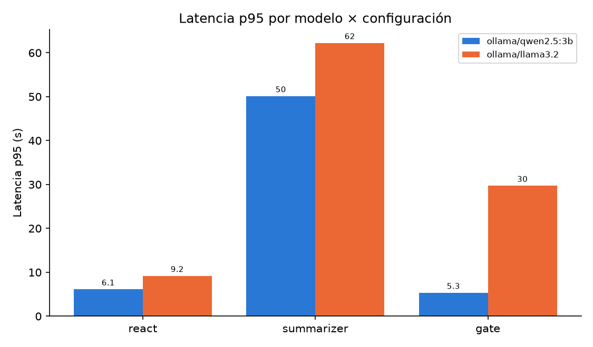
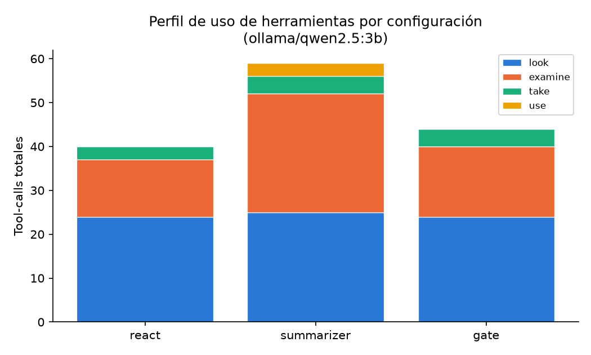
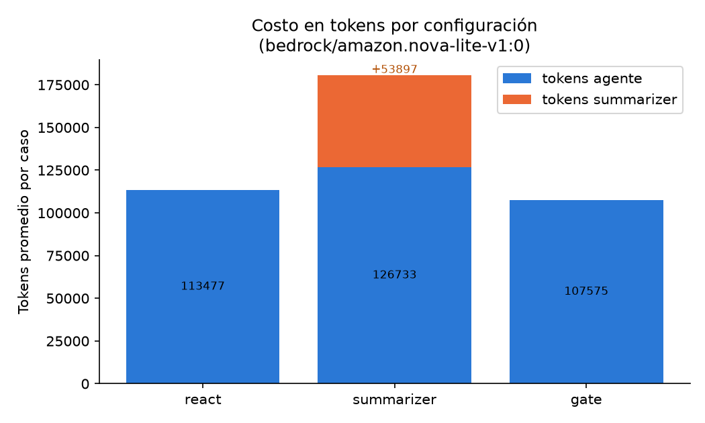
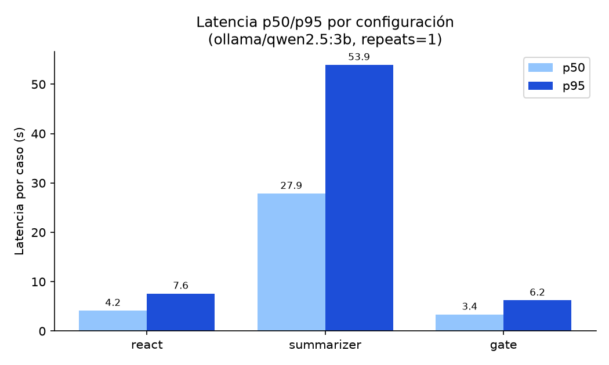

# Informe — Milestone 3: Evaluación sobre salas de escape

> **Estado del documento.** Las 5 secciones están completas con datos reales de
> una corrida local (`ollama` / `qwen2.5:3b`, 8 escenarios × 3 configs × **3
> repeats** = 72 casos). Marcamos con `†` los números que se refrescan con la
> corrida en Bedrock (modelo fuerte), pendiente del lease de AWS. Las
> conclusiones ya son estables.

## Resumen

Aplicamos nuestro framework de M1+M2 a un **mundo simulado tipo sala de
escape** (inspirado en ALFWorld): el agente debe abrir la puerta principal
usando cinco verbos (`look`, `examine`, `take`, `use`, `go`). Construimos una
**infraestructura de evaluación reproducible** ([`eval/run.py`](eval/run.py))
que corre el agente sobre los 8 escenarios, captura la traza completa por caso
y produce métricas cuantitativas y una dimensión cualitativa vía LLM-as-judge
([`eval/judge.py`](eval/judge.py)). Comparamos dos ejes del framework mediante
experimentos controlados —**resumen de estado on/off** y **gate determinístico
on/off**— y categorizamos los modos de fallo sobre trazas reales.

---

## 1. Aproximación

### 1.1 Reutilización del framework M1+M2

El agente de M3 es **el mismo `MyAgent`** de M1+M2, sin bifurcar. El problema se
resuelve registrando las herramientas del mundo y dejando que el bucle ReAct de
M1 (sense → decide → act) opere, apoyado en el estado conversacional y la
ventana de memoria de M2:

- **Bucle y herramientas (M1).** El runner registra los verbos del mundo con
  `agent.register_tool(...)` ([`mia_world/cli.py`](mia_world/cli.py),
  [`eval/run.py`](eval/run.py)). El agente los expone al LLM en cada llamada y
  ejecuta el `tool_call` elegido. Los **errores de las herramientas vuelven
  como observaciones** (no rompen el bucle), lo que permite que el modelo
  corrija sobre la marcha —clave en un dominio donde equivocarse de llave o de
  ID es esperable.
- **Estado y memoria (M2).** La sala de escape es un problema **estado-full**:
  lo que se puede hacer depende de lo ya observado, tomado y abierto. La ventana
  deslizante de M2 (recencia + preservación del turno inicial) mantiene el
  objetivo presente en conversaciones largas, y los escenarios multi-sala
  (`apartment-keys`, `office-sequence`) ejercitan justamente esa memoria: hay
  que **navegar, recordar el mapa y volver**.

### 1.2 Especializaciones para M3

Lo mínimo, y todo **detrás de config/flags** para no contaminar M1/M2:

- **System prompt inyectable.** El default de `MyAgent` es genérico; el runner
  de M3 inyecta `ESCAPE_ROOM_SYSTEM_PROMPT` por config
  ([`agent.py`](student_framework/agent.py),
  [`__init__.py`](student_framework/__init__.py)). Así una corrida de M1/M2
  nunca arranca "creyéndose" en una sala de escape. El prompt está **versionado**
  (`ESCAPE_ROOM_SYSTEM_PROMPT_VERSION`) y ese identificador viaja en el meta de
  cada corrida.
- **Summarizer de estado (opcional).** Un `GameState` estructurado que, antes de
  cada llamada, re-deriva el estado de la partida (inventario, ubicación,
  acciones, salidas) con una llamada LLM extra y lo inyecta como contexto. Es
  **memoria comprimida**, activable con `use_summarizer`; su costo se contabiliza
  **aparte** para que el experimento compare de forma justa.
- **Gate determinístico (opcional).** Un `if` que garantiza lo que ningún prompt
  puede: no usar un objeto que no está en el inventario, no inventar IDs
  ([`_ejecutar_tool`](student_framework/agent.py); gate específico en
  [`eval/run.py`](eval/run.py)). Detrás de flag: el contrato de M1 (`run` puede
  terminar con texto sin tools) se mantiene.

Ninguna de estas piezas es el comportamiento por defecto: el agente "base" de
M3 es ReAct puro con el prompt de escape.

---

## 2. Métricas

Medimos sobre el **estado del mundo**, no sobre el texto del agente: un
escenario cuenta como resuelto solo si `check_goal` verifica el cambio físico
(p. ej. `puerta_principal.open_state == "open"`). Esto da una señal objetiva e
inmune a que el agente "diga" que resolvió.

### 2.1 Cuantitativas

| Métrica | Qué mide | Por qué la elegimos |
|---|---|---|
| **Accuracy** (con **IC de Wilson 95%**) | Fracción de casos resueltos | Es la medida directa de éxito. Reportamos el intervalo de Wilson porque *"una corrida no es una medición"*: con 8 escenarios y pocos repeats, el intervalo es más honesto que un puntaje pelado (y Wilson se porta mejor que la normal cerca de 0/1). |
| **pass^k** | Resolver el escenario en **todos** los k intentos | El agente actúa **sin supervisión**, así que lo relevante no es "alguna vez lo logró" sino "lo logra de forma consistente". pass^k castiga la varianza que la accuracy promedio esconde. |
| **Overhead vs. óptimo** | `tool_calls / óptimo`, sobre los resueltos | Mide **eficiencia**: cuánto se aleja del camino ideal. El óptimo **no se hardcodea**: se **deriva por BFS** sobre el grafo de estados ([`eval/optimal.py`](eval/optimal.py)), y coincide con el enunciado en los 8/8 escenarios (cross-validación). |
| **Costo por caso resuelto** | Tokens totales (incl. fallidos) / resueltos | El costo relevante es *"cuánto cuesta un éxito"*, no el promedio por corrida: un agente que falla barato no es más barato si nunca resuelve. Separamos tokens de **agente** vs. **summarizer**. |
| **Latencia p50 / p95** | Percentiles de wall-clock por caso | La clase es explícita: *"nunca promedio"*. Los percentiles muestran la cola (p95), que es donde vive la mala experiencia. |

### 2.2 Dimensión cualitativa (LLM-as-judge)

La dimensión es **calidad de la trayectoria**: *¿el agente exploró con método?*
La elegimos así deliberadamente: si el agente **abrió la puerta**, eso ya lo
verifica `check_goal` **por código**, y la regla de la clase 8 es **no usar un
judge donde hay verificación programática**. El judge aporta donde no la hay: en
*cómo* se comportó en el camino (look al entrar, examinar antes de tomar, no
repetir acciones, no usar objetos que no tiene), más allá del éxito binario.

- **Cómo.** El judge puntúa la trayectoria **1–5** con una rúbrica explícita
  ([`eval/judge.py`](eval/judge.py)), sobre la **traza real de tool-calls** (no
  sobre el output final, que muchas veces no llega). Devuelve el puntaje **y su
  justificación**, para poder auditarlo.
- **Confiabilidad (meta-eval).** Etiquetamos a mano las trazas del golden set y
  medimos el **kappa de Cohen** entre el judge y el humano (`cohen_kappa`). Un
  kappa alto valida el judge; uno bajo dice que hay que ajustar la rúbrica antes
  de confiar en sus números.

### 2.3 Cómo se computan (reproducibilidad)

Todo sale de `python eval/run.py` sin pasos manuales. Cada corrida escribe
`cases.jsonl` (traza por caso), `summary.json` y `summary.md`, y **versiona** en
el meta: modelo (`BEDROCK_MODEL_ID`), cuenta/perfil AWS, versión de prompt y
commit de git —sin esto, dos corridas de distintas máquinas serían
indistinguibles. El núcleo de métricas, la búsqueda del óptimo y el judge están
**testeados sin LLM** ([`tests/test_eval_harness.py`](tests/test_eval_harness.py),
[`tests/test_judge.py`](tests/test_judge.py)).

---

## 3. Resultados

> Corrida: `python eval/run.py --repeats 3` con `ollama` / `qwen2.5:3b`, prompt
> `escape-v1`, `max_iterations=30`, 8 escenarios × 3 configs × 3 repeats = 72
> casos. Un piloto previo en `nova-lite-v1:0` (Bedrock, config `react`) dio el
> mismo cuadro (0/8, prosa dominante), lo que corrobora que el hallazgo no es
> artefacto de un modelo.

### 3.1 Tabla principal por configuración

Cada config corre los 8 escenarios × 3 repeats = 24 casos.

| Config | Accuracy (IC95%) | pass^k | Varianza (std) | Latencia p50/p95 (s) |
|---|---:|---:|---:|---:|
| `react` | 0/24 [0.0, 0.14]† | 0/8† | 0.0 | 2.7 / 6.1 |
| `summarizer` | 0/24 [0.0, 0.14]† | 0/8† | 0.0 | **25.9 / 50.1** |
| `gate` | 0/24 [0.0, 0.14]† | 0/8† | 0.0 | 3.6 / 5.3 |

Con este modelo **ninguna configuración abre una puerta**, y la **varianza entre
repeats es 0**: no es *flaky*, falla de forma **consistente**. El techo lo pone
la disciplina de tool-calling, no el framework (§3.3). (El único éxito que vimos
—`study-with-key` en un smoke suelto— no se repitió en 3 intentos: 0/3.)

### 3.2 Accuracy por dificultad y por escenario

Todas las celdas dan 0 con `qwen2.5:3b`. La vista escenario × config lo hace
explícito y sirve para leer *dónde* falla cada config (con Bedrock, dónde
empieza a resolver):



El interés no está en la accuracy —uniformemente 0— sino en **cómo** falla cada
config, que es donde los experimentos separan aguas (§3.3, §4).

**Óptimo por escenario (BFS, = enunciado):** study-with-key 3 · color-locks 11 ·
apartment-keys 7 · library-search 7 · office-sequence 13 · extreme-archive 4 ·
vault-combination 21 · backtracking-vault 18.

### 3.3 Análisis de errores (sobre trazas reales)

Categorías (definidas y verificadas **mirando trazas**, no a priori):
`success` · `crash` · `loop_detected` · `exhausted_iterations` · `tool_errors` ·
`prosa_en_vez_de_tool`.



Sobre 24 casos por config (8 escenarios × 3 repeats):

| Config | prosa_en_vez_de_tool | loop_detected | tool_errors |
|---|---:|---:|---:|
| `react` | 24 | 0 | 0 |
| `summarizer` | 19 | **3** | **2** |
| `gate` | 24 | **0** | **0** |

**Modo dominante: `prosa_en_vez_de_tool`.** El agente **deja de llamar
herramientas y "habla"** en lugar de actuar. Dos variantes, tomadas de las
trazas reales:

- **inversión de rol:** imparte instrucciones a un tercero
  (*"Haz uso de la llave plateada en el cofre…"*).
- **intención anunciada:** anuncia en primera persona lo que hará
  (*"Volveré a examinar el escritorio…"*).

El fallo es de **disciplina de tool-calling**, no de razonamiento espacial: el
agente entiende qué hacer pero lo **describe** en vez de emitir el `tool_call`.
Por eso el gate (§4.2) no lo elimina —solo limpia los fallos por uso inválido.

**Redundancia (señal de loop).** Medimos la racha máxima de tool-calls idénticas
por caso:



`react` y `gate` casi no repiten (racha 1); el **`summarizer` es el que más
loopea** (casos con rachas de 3 y hasta 5). Consistente con que re-inyectar un
estado resumido a veces **refuerza** una acción equivocada en lugar de
corregirla —otro costo del resumen, además de la latencia.

### 3.4 Resultados cualitativos (LLM-as-judge)

Calidad de exploración (1–5), sobre las trazas reales:

| Config | Casos puntuados | Promedio |
|---|---:|---:|
| `react` | 17/24 | **3.41**† |
| `gate` | 18/24 | 3.33† |
| `summarizer` | 19/24 | **2.63**† |



Hallazgo: el **`summarizer` produce trayectorias de menor calidad** (2.63 vs.
3.41 de `react`), consistente con que loopea más (§3.3) —el resumen no solo
cuesta más tiempo/tokens, sino que **empeora la trayectoria**. `react` y `gate`
quedan parejos (~3.4): el gate no degrada la exploración.

**Dato importante:** el judge solo puntuó **17–19/24** —en el resto,
`qwen2.5:3b` no produjo salida estructurada válida. Es decir, **en un modelo
chico hasta el judge es poco confiable**; por eso la meta-eval con kappa (§2.2)
es la que valida sus números, y esperamos cobertura completa en Bedrock.

### 3.5 Comparación cross-modelo / proveedor

Como los resultados de accuracy están acotados por el modelo, comparamos **el
mismo framework sobre varios modelos** para separar *límites del modelo* de
*límites del framework*. Cada corrida versiona su `provider`/`model`, y
`scripts/comparar_modelos_m3.py` arma la comparativa a partir de todas las
corridas presentes —basta correr un modelo nuevo y volver a ejecutarlo.



Modelos: `qwen2.5:3b` (Ollama, local) †; **pendiente** `nova-lite` (Bedrock,
modelo fuerte) y `llama3.2` (Ollama). La lectura esperada: los efectos de los
experimentos (costo del resumen, limpieza del gate) deberían **persistir entre
modelos**, mientras que la **accuracy** debería subir con el modelo fuerte —lo
que confirmaría que el 0/8 es del modelo, no del framework.

### 3.6 Observabilidad: perfil de comportamiento

Para no reducir todo a "0/8", instrumentamos **qué hace** el agente:



- **Perfil de uso de herramientas.** El agente **explora pero rara vez
  ejecuta**: domina `look`/`examine`, hace poco `take`, y en esta corrida
  `use`=0 (react/gate) y `go`=0 en todos. Como abrir la puerta requiere `use`
  (y los multi-sala requieren `go`), este perfil *es* la cara agregada del 0/8.
  El mecanismo se ve en las trazas: en el punto de ejecutar, el agente
  **describe la acción en prosa** en vez de emitirla —p. ej. escribe *"Haz uso
  de la llave plateada en el cofre"* o *"`go(norte)`"* como texto, sin llamar la
  herramienta. Es el mismo `prosa_en_vez_de_tool` visto desde el uso de tools.
  **No es incapacidad:** en un smoke aislado el agente sí emitió
  `use(llave, puerta)` y resolvió `study-with-key`; es **inconsistencia**, con
  varianza entre corridas —otra razón para medir `pass^k` y no una sola corrida.
- **Tasa de acción inválida** (`tool_errors/tool_calls`): `react` 0.0, `gate`
  0.0, `summarizer` 0.03. Baja en todos porque el agente apenas llega a
  intentar acciones que un gate rechazaría; el gate la mantiene en 0 por
  construcción (el `summarizer`, que sí intenta más `use`, es el único con
  acciones inválidas).
- **Progreso parcial** (`items_taken`, `rooms_visited`, `items_opened`): con
  `qwen2.5:3b` es ~0 (el agente se traba antes de avanzar). Esta métrica se
  captura por corrida y será informativa con un modelo que sí actúe (Bedrock):
  permite medir *cuánto* avanzó aunque no abra la puerta.

**Costo en tokens** (agente vs. summarizer):



El summarizer suma **~6.100 tokens/caso (+65%)** sin resolver nada más. Además
del conteo de tokens, el harness estima el **costo en USD** por caso y por caso
resuelto (`cost_usd_*` en el `summary.json`), usando el pricing on-demand del
modelo —$0 para modelos locales como `qwen2.5:3b`, y con precio real en Bedrock
(`nova-lite`), donde el sobrecosto del resumen se traduce directamente en
dólares.†

---

## 4. Experimentos

Dos experimentos, cada uno aislando **una** pieza del framework. Todos corren
sobre el mismo dataset y con el mismo `max_iterations`; solo cambia el eje bajo
estudio (los demás quedan fijos).

### 4.1 Experimento 1 — Resumen de estado (summarizer on/off)

- **Qué cambiamos.** `react` (sin resumen) vs. `summarizer` (re-deriva el
  `GameState` y lo inyecta cada paso). `--configs react,summarizer`.
- **Hipótesis.** El resumen **ayuda solo cuando el contexto crudo no entra**
  (p. ej. `extreme-archive`, diseñado para no caber en 16 K tokens) y **perjudica
  cuando entra** (easy/medium): agrega costo y una re-derivación *lossy* que puede
  corromper IDs/llaves, justo donde el estado exacto es todo.
- **Qué miramos.** Accuracy por dificultad, latencia (¿cuánto cuesta el resumen?)
  y modos de fallo.



- **Resultado.** Accuracy **sin cambios** (0/24 vs 0/24), pero el resumen
  **multiplica la latencia ~8×**: p95 **50.1 s** vs 6.1 s de `react` (la llamada
  LLM extra por paso). Además **empeora los modos de fallo**: introduce 2
  `tool_errors` y **3 `loop_detected`** que `react` no tiene (0 y 0) —re-inyectar
  el estado resumido a veces refuerza una acción equivocada. No pudimos confirmar
  la parte "ayuda en `extreme-archive`" de la hipótesis: con este modelo el
  agente falla **aguas arriba** (prosa) y nunca llega a desbordar el contexto,
  que es donde el resumen pagaría.
- **Conclusión.** En este régimen el resumen es **costo puro**: confirma la
  primera mitad de la hipótesis (*perjudica cuando el contexto crudo entra*). La
  segunda mitad queda para un modelo que sí llame herramientas (Bedrock). Motiva
  el **summarizer selectivo** de §5.

### 4.2 Experimento 2 — Gate determinístico (gate on/off)

- **Qué cambiamos.** `react` (gate off) vs. `gate` (un `if` bloquea, antes de
  ejecutar, usar objetos fuera del inventario o IDs inexistentes).
  `--configs react,gate`.
- **Hipótesis.** *"Ningún prompt garantiza X; un gate sí."* El prompt tiene
  ~200 líneas de "REGLAS ABSOLUTAS" que **no** evitan el uso inválido; un gate de
  ~15 líneas y **0 tokens** debería eliminar `tool_errors`/uso inválido.
- **Qué miramos.** Accuracy y desglose de modos de fallo (¿baja el uso inválido?),
  latencia (el gate no gasta tokens).
- **Resultado.** Accuracy **sin cambios** (0/24): el gate **no puede forzar** que
  el modelo emita un `tool_call` —solo bloquea las inválidas—, así que no cura la
  prosa. **Pero deja el perfil de fallos más limpio de los tres:** `tool_errors`
  **0** y `loop_detected` **0** sobre 24 casos, frente al `summarizer` (2
  tool_errors + 3 loops). Y es incluso **ligeramente más rápido** que `react`
  (p95 5.3 vs 6.1 s), a 0 tokens de costo.
- **Conclusión.** El gate **entrega lo que el prompt no puede**: elimina por
  construcción los fallos de uso inválido y los loops. No genera éxitos por sí
  solo —eso requiere un modelo que llame herramientas—, pero es un **piso de
  garantías gratis** sobre el que ese modelo rendiría mejor. Confirma la máxima:
  *un `if` garantiza lo que ningún prompt garantiza*.

---

## 5. Limitaciones y próximos pasos

**Limitaciones asumidas.**

- **Modelo chico.** Con modelos chicos (`qwen2.5:3b` local; el piloto en
  `nova-lite` mostró lo mismo), el modo de fallo dominante es de **disciplina de
  tool-calling** (prosa en vez de acción), no de razonamiento espacial. Nuestros
  resultados de accuracy están acotados por el modelo, no por el framework: por
  eso el aporte de los experimentos se ve en **cómo** falla (latencia del resumen,
  limpieza del gate), no en el 0/8. Un modelo más capaz debería mover el techo.
- **Óptimo como referencia de eficiencia.** El overhead es relativo al óptimo
  **derivado por búsqueda**; es una medida de eficiencia, no una afirmación de
  minimalidad absoluta (aunque coincide con el enunciado en los 8/8).
- **Judge = LLM.** La dimensión cualitativa depende de un LLM; su confiabilidad
  se apoya en el kappa contra etiquetas humanas del golden set. Un kappa bajo
  invalidaría sus números.
- **Escala del dataset.** 8 escenarios: los intervalos de confianza son anchos.
  pass^k y Wilson lo hacen explícito, pero no lo eliminan.
- **`max_iterations = 30` es del harness**, no del enunciado: lo subimos para que
  el techo de iteraciones no sesgue la accuracy (`vault-combination` necesita 21).

**Qué construiríamos a continuación.**

1. **Gate más rico** (si el Experimento 2 lo respalda): extender las garantías
   determinísticas a más precondiciones del mundo, y medir hasta dónde el gate
   sustituye prompt.
2. **Summarizer selectivo:** activar el resumen **solo** cuando el contexto crudo
   desborda, en vez de siempre —convirtiendo el hallazgo del Experimento 1 en una
   política.
3. **Planner explícito vs. ReAct** en `office-sequence` (goal compuesto/ordenado):
   el escenario premia descomponer y planificar el orden de sub-objetivos.
4. **Más repeats y más modelos** para angostar los intervalos y separar límites
   del framework de límites del modelo.

---

## Apéndice A — Cómo reproducir

```bash
# --- Con Ollama (local, sin lease) ---
OLLAMA_HOST=http://localhost:11434 OLLAMA_MODEL=qwen2.5:3b \
  python eval/run.py --repeats 3

# --- Con Bedrock (modelo fuerte; requiere lease + nova-lite habilitado) ---
python eval/run.py --repeats 3          # toma el provider del .env

# Dimensión cualitativa (LLM-as-judge) sobre una corrida
python eval/judge.py eval/results/<timestamp>/cases.jsonl

# Gráficos de UNA corrida
python scripts/generar_graficos_m3.py

# Gráficos COMPARANDO todos los modelos/proveedores corridos
python scripts/comparar_modelos_m3.py
```

Salidas en `eval/results/<timestamp>/`: `cases.jsonl`, `summary.json`,
`summary.md`. Cada corrida versiona `provider`/`model` en su meta, así la
comparación cross-modelo se arma sola a partir de las corridas presentes.
Golden set y flujo de etiquetado en [`eval/golden/README.md`](eval/golden/README.md).
