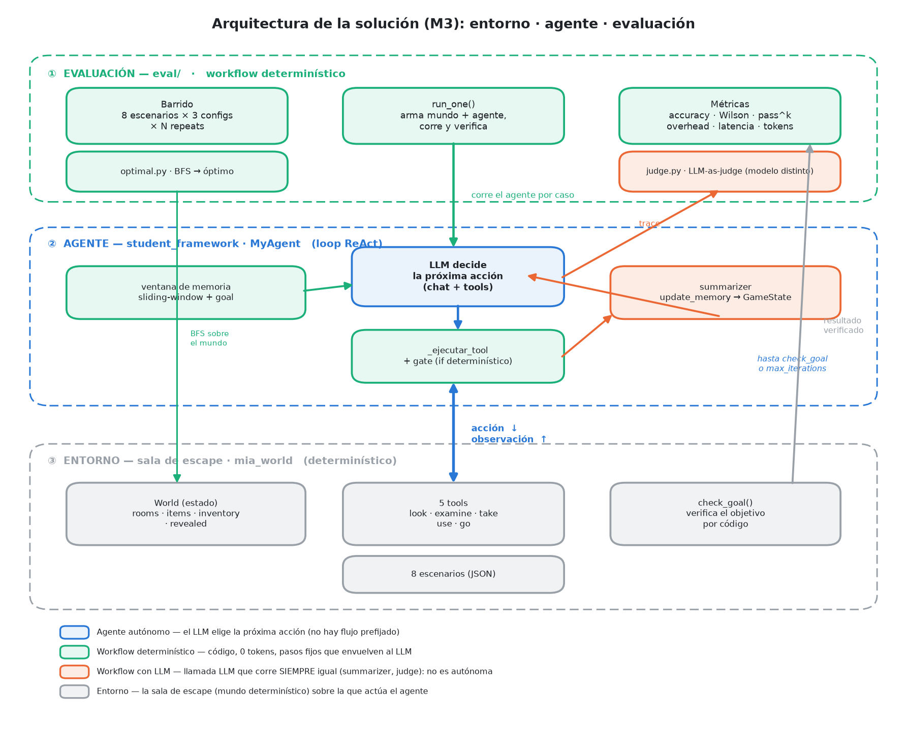
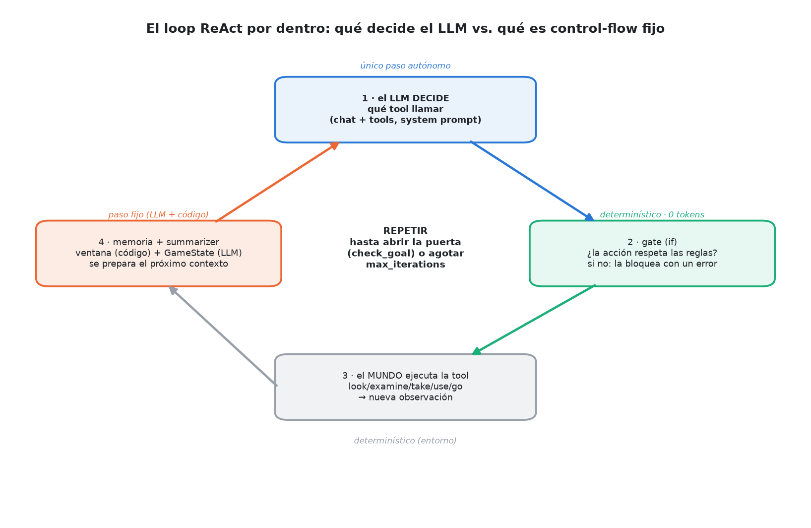
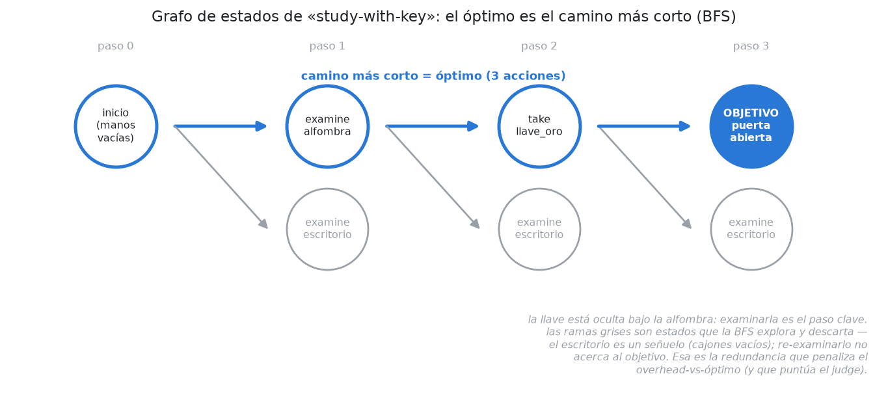
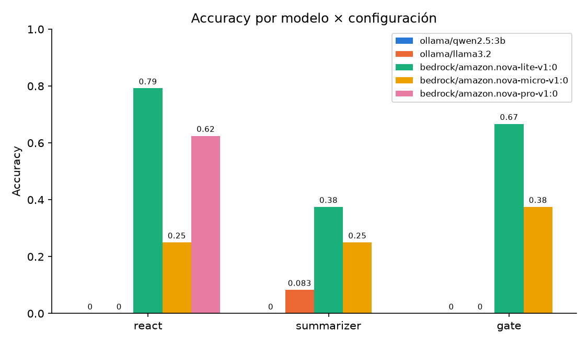

# Informe — Milestone 3: Evaluación sobre salas de escape

> **Serie — el hilo del escape room.** Tres milestones hacia un agente que
> **juega y se evalúa en una sala de escape** (*gamification* como banco de
> pruebas): [M1](INFORME_M1.md) ▸ el agente y sus herramientas · [M2](INFORME_M2.md)
> ▸ memoria y robustez · **M3 ▸ evaluación en el juego**. Índice:
> [INFORMES.md](INFORMES.md).

> **Estado del documento.** Las 5 secciones están completas con datos reales de
> **Bedrock**: la corrida canónica es `amazon.nova-lite-v1:0`, 8 escenarios × 4
> configs × **3 repeats** = 96 casos, más una **escalera de capacidad**
> (`nova-micro` → `nova-lite` → `nova-pro`) y el judge fuerte
> (`nova-pro` juzgando a `nova-lite`, cobertura 96/96). Las corridas locales
> (`qwen2.5:3b`, `llama3.2`) se conservan como comparación cross-modelo (§3.5).
>
> **El hallazgo que ordena el informe:** el techo dejó de ser el modelo. La
> accuracy sube de 0/24 a 0.792 entre el modelo local y `nova-lite`, y **deja de
> subir** en `nova-pro` (0.625, sin diferencia significativa). Lo que falta para
> cerrar la brecha hay que buscarlo en el diseño del agente, no en pagar por un
> modelo más grande (§3.5, §5).

---

## Índice

- [Resumen](#resumen)
1. [Aproximación](#1-aproximación)
2. [Métricas](#2-métricas)
3. [Resultados](#3-resultados)
4. [Experimentos](#4-experimentos)
5. [Limitaciones y próximos pasos](#5-limitaciones-y-próximos-pasos)
- [Apéndice A — Cómo reproducir](#apéndice-a--cómo-reproducir)

---

## Resumen

Aplicamos nuestro framework de M1+M2 a un **mundo simulado tipo sala de
escape** (inspirado en ALFWorld): el agente debe abrir la puerta principal
usando cinco verbos (`look`, `examine`, `take`, `use`, `go`). Construimos una
**infraestructura de evaluación reproducible** ([`eval/run.py`](eval/run.py))
que corre el agente sobre los 8 escenarios, captura la traza completa por caso
y produce métricas cuantitativas y una dimensión cualitativa vía LLM-as-judge
([`eval/judge.py`](eval/judge.py)). Comparamos dos ejes del framework mediante
experimentos controlados —**resumen de estado on/off** y **gate determinístico
on/off**— y categorizamos los modos de fallo sobre trazas reales.

---

## 1. Aproximación

### 1.1 Reutilización del framework M1+M2

El agente de M3 es **el mismo `MyAgent`** de M1+M2, sin bifurcar. En el lenguaje
de la clase de patrones de composición, **M1+M2 son el "patrón 0" (un *augmented
LLM* —system prompt + tools + memoria— dentro de un loop ReAct con condiciones de
corte)**, y M3 no lo reemplaza: lo aplica. Es además un **agente autónomo**, no un
*workflow*, según la distinción de *Building Effective Agents* (Anthropic, 2024):
la decisión del control-flow la toma **la LLM en runtime** (elige qué tool llamar
y cuándo parar), no nuestro código. Esa es la elección correcta para la sala de
escape —un espacio **abierto y de pasos impredecibles**, donde la clase ubica a
la agencia sobre el workflow—; el precio, que asumimos, es **más varianza y
debugging más difícil** que un pipeline determinístico. Lo resolvemos registrando
las herramientas del mundo y dejando operar el bucle ReAct de M1 (sense → decide
→ act), apoyado en el estado y la memoria de M2:

- **Bucle y herramientas (M1).** El runner registra los verbos del mundo con
  `agent.register_tool(...)` ([`mia_world/cli.py`](mia_world/cli.py),
  [`eval/run.py`](eval/run.py)). El agente los expone al LLM en cada llamada y
  ejecuta el `tool_call` elegido. Los **errores de las herramientas vuelven
  como observaciones** (no rompen el bucle), lo que permite que el modelo
  corrija sobre la marcha —clave en un dominio donde equivocarse de llave o de
  ID es esperable.
- **Estado y memoria (M2).** La sala de escape es un problema **estado-full**:
  lo que se puede hacer depende de lo ya observado, tomado y abierto. Aplicamos
  *context engineering* (Anthropic, *Effective context engineering for AI
  agents*): la ventana deslizante de M2 **preserva** el ancla (el goal/turno
  inicial) y **descarta** los turnos del medio —no solo por costo, sino porque
  *"más contexto no es mejor contexto"* (Context Rot, uno de los cuatro
  problemas del contexto de la clase: límite, costo, latencia, calidad)—. En la
  taxonomía CoALA, esto es **memoria de trabajo** (la ventana); los escenarios
  multi-sala (`apartment-keys`, `office-sequence`) la ejercitan: hay que
  **navegar, recordar el mapa y volver**.

**Arquitectura en una imagen.** El sistema son tres capas —entorno, agente y
evaluación— y la distinción *agente vs. workflow* se ve al colorearlas: el único
componente **autónomo** (donde la LLM decide en runtime) es el núcleo del loop
ReAct; todo lo que lo rodea es **workflow determinístico** (código de 0 tokens:
gate, ventana de memoria, harness, BFS) o **workflow con LLM en paso fijo**
(summarizer y judge: llaman al LLM, pero corren siempre igual, no deciden el
control-flow).



El corazón del agente es el loop ReAct. Visto de cerca, un solo paso del ciclo es
autónomo (la LLM elige la tool); los otros tres son control-flow fijo:



### 1.2 Especializaciones para M3

Lo mínimo, y todo **detrás de config/flags** para no contaminar M1/M2:

- **System prompt inyectable.** El default de `MyAgent` es genérico; el runner
  de M3 inyecta `ESCAPE_ROOM_SYSTEM_PROMPT` por config
  ([`agent.py`](student_framework/agent.py),
  [`__init__.py`](student_framework/__init__.py)). Así una corrida de M1/M2
  nunca arranca "creyéndose" en una sala de escape. El prompt está **versionado**
  (`ESCAPE_ROOM_SYSTEM_PROMPT_VERSION`) y ese identificador viaja en el meta de
  cada corrida.
- **Summarizer de estado (opcional).** Un `GameState` estructurado que, antes de
  cada llamada, re-deriva el estado de la partida (inventario, ubicación,
  acciones, salidas) con una llamada LLM extra y lo inyecta como contexto. Parte
  de tratar el *contexto como recurso escaso* (clase): la ventana es limitante y
  **qué inyectar es una decisión de ingeniería con costo**. Elegimos memoria
  **estructurada** y no un resumen de texto libre a propósito —la clase señala
  que *"la estructura fuerza a curar, con menos pérdida que un resumen libre"*—.
  Activable con `use_summarizer`; su costo se contabiliza **aparte** para que el
  experimento compare de forma justa.
- **Gate determinístico (opcional).** Es el **patrón de gate** de la clase (el
  chequeo determinístico entre pasos del *prompt chaining*): *"ningún prompt
  garantiza 'monto ≤ límite'; un gate sí"*. Cumple las tres funciones que la
  clase le asigna —**reglas exactas** (no usar un objeto fuera del inventario, no
  inventar IDs son un `if`, no una probabilidad), **cortar temprano** y **registro
  auditable** (el error accionable)— a **0 tokens y 100 % determinístico**
  ([`_ejecutar_tool`](student_framework/agent.py); gate específico en
  [`eval/run.py`](eval/run.py)). Detrás de flag: el contrato de M1 (`run` puede
  terminar con texto sin tools) se mantiene.

Ninguna de estas piezas es el comportamiento por defecto: el agente "base" de
M3 es ReAct puro con el prompt de escape. Seguimos la **regla de simplicidad
composable** de la clase (Anthropic): empezar por lo más simple y subir en
complejidad solo con evidencia; por eso el resumen y el gate son *opcionales* y
se evalúan como experimentos, no se asumen.

---

## 2. Métricas

Medimos sobre el **estado del mundo**, no sobre el texto del agente: un
escenario cuenta como resuelto solo si `check_goal` verifica el cambio físico
(p. ej. `puerta_principal.open_state == "open"`). Esto da una señal objetiva e
inmune a que el agente "diga" que resolvió.

**Marco conceptual (clase de evaluación de agentes).** Tratamos la eval como una
*especificación ejecutable* —"de 'lo probé y anda' a una spec"—, no como un test
de igualdad: en un agente *"correcto es un juicio, no una igualdad verificable"*.
De ahí tres decisiones que fundamentan lo que sigue: (1) reportamos un **vector
de dimensiones**, no un score único, porque *"la calidad no es un escalar"* y *"un
score único es cómodo para un dashboard y desastroso para diagnosticar"*; (2) las
restricciones **duras** (el goal, verificado por `check_goal`) son un **gate
binario**, no un término de un promedio ponderado *("las duras son un gate, no un
término de una suma")*; (3) como *"una corrida es una anécdota, no una medición"*,
cada métrica viaja con su dispersión (pass^k, IC de Wilson, repeats).

### 2.1 Cuantitativas

| Métrica | Qué mide | Por qué la elegimos |
|---|---|---|
| **Accuracy** (con **IC de Wilson 95%**) | Fracción de casos resueltos | Es la medida directa de éxito. Reportamos el intervalo de Wilson porque *"una corrida no es una medición"*: con 8 escenarios y pocos repeats, el intervalo es más honesto que un puntaje pelado (y Wilson se porta mejor que la normal cerca de 0/1). |
| **pass@k / pass^k** | pass@k: resolver en **al menos uno** de k intentos (capacidad). pass^k: resolverlo en **todos** (confiabilidad) | Los reportamos **juntos** porque la brecha entre ambos **es** la varianza (*"puede resolverlo"* vs. *"lo resuelve siempre"*). Para un agente que actúa **sin supervisión** manda pass^k (τ-bench); pass@k (de HumanEval) sería la métrica correcta solo si un humano pudiera reintentar/elegir —que no es nuestro caso—. |
| **Overhead vs. óptimo** | `tool_calls / óptimo`, sobre los resueltos | Mide **eficiencia**: cuánto se aleja del camino ideal. El óptimo **no se hardcodea**: se **deriva por BFS** sobre el grafo de estados ([`eval/optimal.py`](eval/optimal.py)), y coincide con el enunciado en los 8/8 escenarios (cross-validación). |
| **Tokens por caso resuelto** | Tokens totales (incl. fallidos) / resueltos | El costo relevante es *"cuánto cuesta un éxito"*, no el promedio por corrida: un agente que falla barato no es más barato si nunca resuelve. Lo medimos en **tokens** (moneda independiente del proveedor) porque con Ollama el costo en USD es $0; el USD es un derivado directo que se "enciende" solo al correr con un proveedor pago (Bedrock). Separamos tokens de **agente** vs. **summarizer**. |
| **Latencia p50 / p95** | Percentiles de wall-clock por caso | La clase es explícita: *"nunca promedio"*. Los percentiles muestran la cola (p95), que es donde vive la mala experiencia. |

**Qué significa "óptimo derivado por BFS".** El overhead se mide contra un óptimo
que no copiamos del enunciado: lo buscamos. Cada arista del grafo de estados del
mundo es una tool-call y el óptimo es el camino más corto desde el estado inicial
hasta uno que cumple `check_goal`. El siguiente diagrama es ese grafo para
`study-with-key` (reusa la BFS real de [`eval/optimal.py`](eval/optimal.py) sobre
`make_world_tools`):



El camino azul (`examine alfombra` → `take llave_oro` → `use` = 3 acciones) es el
óptimo; las ramas grises son estados que la búsqueda explora y descarta. El
escritorio es un **señuelo** (cajones vacíos): re-examinarlo no acerca al
objetivo. Esa exploración descartada es exactamente la *redundancia evitable* que
penaliza el overhead-vs-óptimo y que puntúa el judge (§2.2). El BFS coincide con
el enunciado en los 8/8 escenarios, así que la métrica queda cross-validada.

### 2.2 Dimensión cualitativa (LLM-as-judge)

La dimensión es **calidad de la trayectoria**: *¿el agente exploró con método?*
(Usamos los términos con precisión: la **trayectoria** es la secuencia de
decisiones —el concepto—; el **trace** es su registro instrumentado —el
artefacto— que el judge lee.) La elegimos así deliberadamente: si el agente
**abrió la puerta**, eso ya lo verifica `check_goal` **por código**, y la regla
de la clase es **no usar un judge donde hay verificación programática**. El judge
aporta donde no la hay: en *cómo* se comportó en el camino (look al entrar,
examinar antes de tomar, no repetir acciones, no usar objetos que no tiene), más
allá del éxito binario.

- **Cómo.** El judge puntúa la trayectoria con una rúbrica explícita
  ([`eval/judge.py`](eval/judge.py)), sobre la **traza real de tool-calls** (no
  sobre el output final, que muchas veces no llega). Devuelve el puntaje **y su
  justificación** —CoT que hace el veredicto auditable—. Es *pointwise* (puntúa
  una trayectoria), lo apropiado para **monitorear** (la clase reserva *pairwise*
  para *elegir* entre candidatas).
- **Cuándo NO usar el judge.** Seguimos la regla de la clase: *"empujá todo lo
  que puedas hacia código; el judge es para donde de verdad hace falta juicio"*.
  El **éxito** (abrir la puerta) es verificación programática (`check_goal`), así
  que **no** lo juzga el LLM; el judge solo cubre la calidad de exploración, donde
  no hay verificación por código.
- **Confiabilidad (meta-eval).** *"Un judge es un instrumento, no un oráculo: hay
  que calibrarlo contra ground truth."* Comparamos las trazas del golden set
  contra una **referencia determinística** (`reference_verdict`, derivada de la
  traza) y medimos el **kappa de Cohen** (`cohen_kappa`), que corrige el acuerdo
  por azar —un judge que siempre dice lo mismo puede tener 95% de accuracy y
  κ = 0—. Bandas: κ < 0.4 recalibrar, 0.4–0.6 tolerable, 0.6–0.8 trabajable. Si el
  kappa es bajo, no usamos sus números aunque el judge ya esté construido (es lo
  que pasó: κ ≈ 0, §3.4).

### 2.3 Cómo se computan (reproducibilidad)

Todo sale de `python eval/run.py` sin pasos manuales. Cada corrida escribe
`cases.jsonl` (traza por caso), `summary.json` y `summary.md`, y **versiona** en
el meta: modelo (`BEDROCK_MODEL_ID`), cuenta/perfil AWS, versión de prompt y
commit de git —sin esto, dos corridas de distintas máquinas serían
indistinguibles. El núcleo de métricas, la búsqueda del óptimo y el judge están
**testeados sin LLM** ([`tests/test_eval_harness.py`](tests/test_eval_harness.py),
[`tests/test_judge.py`](tests/test_judge.py)).

---

## 3. Resultados

> Corrida canónica: `python eval/run.py --repeats 3` con `bedrock` /
> `amazon.nova-lite-v1:0`, prompt `escape-v1`, `max_iterations=30`, 8 escenarios
> × 4 configs × 3 repeats = **96 casos**, 2 h 03 min, **$0.75**. Resultados en
> `eval/results/20260825-204157/`.

### 3.1 Tabla principal por configuración

Cada config corre los 8 escenarios × 3 repeats = 24 casos.

| Config | Accuracy (IC95%) | pass@k / pass^k | Overhead vs óptimo | Tokens/resuelto | Latencia p50/p95 (s) |
|---|---:|---:|---:|---:|---:|
| `react` | **0.792** [0.595, 0.908] | **1.0** / 0.625 | 2.36x | 143.340 | 24.9 / 31.1 |
| `gate` | 0.667 [0.467, 0.820] | 0.875 / 0.5 | 2.56x | 161.362 | 25.4 / 33.2 |
| `react_generico` | 0.625 [0.427, 0.788] | 0.875 / 0.375 | 2.80x | 114.328 | 26.2 / 30.5 |
| `summarizer` | 0.375 [0.212, 0.573] | 0.5 / 0.25 | 1.79x | 481.678 | **98.7 / 217.5** |

**El resultado más fuerte de la corrida es `pass@k` = 1.0 en `react`.** El agente
resuelve **los 8 escenarios** en al menos uno de los 3 intentos: no hay ninguno
que sea incapaz de resolver. Pero `pass^k` = 0.625 — solo en 5 de 8 lo logra las
tres veces.

Esa brecha entre **capacidad** (1.0) y **confiabilidad** (0.625) es exactamente
lo que las dos métricas existen para separar, y con el modelo local no se podía
ver porque ambas daban 0. El límite del agente **no es saber resolver: es la
consistencia**. Eso reorienta el trabajo pendiente hacia reducir varianza de
trayectoria, no hacia ampliar capacidades (§5).

En el otro extremo, `summarizer` pierde en todos los ejes a la vez: la mitad de
accuracy que `react`, **3,4× más tokens por resuelto** (481 k vs. 143 k) y **7×
peor latencia p95** (217 s vs. 31 s). El §4.1 lo desarrolla.

### 3.2 Accuracy por dificultad y por escenario

La accuracy **cae monótonamente con la dificultad** en los cuatro brazos, que es
lo mínimo que se le pide a un dataset bien graduado:

| Dificultad | `react` | `gate` | `react_generico` | `summarizer` |
|---|---:|---:|---:|---:|
| easy | 3/3 | 3/3 | 3/3 | 2/3 |
| medium | 6/6 | 6/6 | 4/6 | 6/6 |
| hard | 4/6 | 3/6 | 4/6 | 1/6 |
| extreme | 6/9 | 4/9 | 4/9 | **0/9** |


Dos lecturas que la vista agregada esconde. Primero, **`summarizer` colapsa con
la dificultad**: va parejo con el resto en `easy`/`medium` y se derrumba a 1/6 y
**0/9** cuando el horizonte se alarga —justo donde un resumen de estado debería
ayudar más—. Segundo, `react` y `react_generico` empatan en `hard` (4/6): la
ventaja del prompt especializado (§4.3) no es pareja, se juega en `medium` y
`extreme`.

**Óptimo por escenario (BFS, = enunciado):** study-with-key 3 · color-locks 11 ·
apartment-keys 7 · library-search 7 · office-sequence 13 · extreme-archive 4 ·
vault-combination 21 · backtracking-vault 18.

**Higiene de datos: split dev / holdout.** Para no sobreajustar prompt/gate a
escenarios concretos, partimos los 8 en **dev** (`study-with-key`, `color-locks`,
`library-search`, `extreme-archive` —uno por dificultad—) y **holdout**
(`apartment-keys`, `office-sequence`, `vault-combination`, `backtracking-vault`),
y **iteramos solo sobre dev** (el holdout se mira al final). Nuestras decisiones
—prompt `escape-v1`, gate, summarizer— son **genéricas** (no dependen de ningún
escenario), así que no hay riesgo real de overfitting.

Con `nova-lite` el split da **dev 35/48 (0.729)** contra **holdout 24/48
(0.500)**. La brecha existe, pero **desglosada por dificultad no es
overfitting** —es lo contrario—:

| Dificultad | dev | holdout |
|---|---:|---:|
| easy | 11/12 | — |
| medium | 10/12 | **12/12** |
| hard | 5/12 | **7/12** |
| extreme | 9/12 | 5/24 |

En `medium` y `hard` el **holdout rinde mejor que dev**, que es exactamente lo
opuesto a haber ajustado a los casos vistos. **Toda la brecha viene de
`extreme`**, y ahí el problema no es el split sino que los tres escenarios
`extreme` no son igual de difíciles entre sí: dev aporta solo
`extreme-archive` (9/12 = 0.75) mientras holdout aporta `vault-combination` y
`backtracking-vault` (5/24 = 0.21), que son los dos de mayor horizonte del
dataset (óptimos 21 y 18 contra 4).

Dicho de otro modo: la etiqueta `extreme` agrupa cosas muy distintas, y con un
solo escenario por celda en dev el split queda desbalanceado. Es una limitación
del diseño del split, no una señal de sobreajuste.

### 3.3 Análisis de errores (sobre trazas reales)

**Método (deductivo → inductivo).** Siguiendo la clase, las dimensiones de fallo
tienen dos orígenes: *deductivo* (a priori, del dominio) e *inductivo* (a
posteriori, de mirar salidas reales). Arrancamos con categorías genéricas
razonables (`crash`, `exhausted_iterations`, `tool_errors`…), pero la categoría
que domina —`prosa_en_vez_de_tool`, con sus variantes— **no se podía imaginar de
antemano**: salió de mirar los traces. Es la advertencia de la clase: *"si
empezás con categorías, vas a encontrar solo lo que ya sabías"*. Por eso las
categorías que reportamos están **definidas y verificadas mirando trazas**, no a
priori:
`success` · `crash` · `loop_detected` · `exhausted_iterations` · `tool_errors` ·
`prosa_en_vez_de_tool`.


Sobre 24 casos por config (8 escenarios × 3 repeats), con `nova-lite`:

| Config | success | exhausted_iterations | loop_detected | prosa_en_vez_de_tool | crash |
|---|---:|---:|---:|---:|---:|
| `react` | 19 | 3 | 2 | 0 | 0 |
| `gate` | 16 | 7 | 1 | 0 | 0 |
| `react_generico` | 15 | 7 | 0 | 2 | 0 |
| `summarizer` | 9 | 3 | **9** | 1 | **2** |

**El modo de fallo dominante cambió de naturaleza al cambiar el modelo.** Con
`qwen2.5:3b` era `prosa_en_vez_de_tool` —el agente describía la acción en vez de
emitirla, y el loop se cerraba antes de actuar—. Con `nova-lite` ese modo
**prácticamente desaparece**: 0 casos en `react`, 2 en `react_generico`, 1 en
`summarizer`.

Eso es un resultado, no una nota al pie. `prosa_en_vez_de_tool` es un fallo del
**protocolo**: en términos de la Clase 3, el modelo devuelve texto
(`stopReason = end_turn`) donde debía emitir un `toolUse`. Ese fallo **no dice
nada sobre el diseño del agente** —el motor de tool-use de M1 está bien, el
modelo chico no lo acciona—. Los modos que quedan sí hablan del diseño:

- **`exhausted_iterations`** (3 a 7 por brazo): el agente actúa correctamente
  pero no le alcanzan las 30 iteraciones. Es un fallo de **eficiencia de
  trayectoria**, coherente con el overhead de 2.4-2.8× sobre el óptimo (§3.1).
- **`loop_detected`**: repetir la misma tool con los mismos argumentos. Acá está
  el hallazgo fuerte de la sección.

**El `summarizer` loopea, y ese es el mecanismo de su mal desempeño.** Nueve de
sus 24 casos (37 %) terminan en `loop_detected`, contra 2 de `react`. La racha
máxima de tool-calls idénticas consecutivas es la medida directa:

| Config | racha máxima | casos con racha ≥ 3 |
|---|---:|---:|
| `react_generico` | 3 | 1 |
| `gate` | 12 | 3 |
| `react` | 15 | 5 |
| `summarizer` | **23** | **9** |

Veintitrés llamadas idénticas seguidas. Re-inyectar un estado resumido en cada
turno **no ancla al agente, lo encierra**: si el resumen omite o deforma el
efecto de la última acción, el agente vuelve a intentarla, y el resumen siguiente
—derivado de esa misma interacción— vuelve a omitirla. El §4.1 cierra el
argumento con el contraste estadístico.


**Prioridad = frecuencia × costo, no frecuencia sola.** La clase advierte que
priorizar por frecuencia esconde los modos raros pero caros. Lo computamos
(`failure_priority` en el `summary.json`, costo = latencia total atribuible):

| Modo de fallo | Frecuencia | Latencia media | **Costo total (freq × costo)** |
|---|---:|---:|---:|
| `loop_detected` | 12 | **125.0 s** | **1.499,8 s** |
| `exhausted_iterations` | **20** | 40.3 s | 805,4 s |
| `crash` | 2 | **132.8 s** | 265,6 s |
| `prosa_en_vez_de_tool` | 3 | 40.4 s | 121,1 s |

*(`success` aparece en el JSON con 59 casos y 1.460,5 s: no es un fallo, pero
sirve de referencia —los loops solos cuestan más tiempo que todos los éxitos
juntos.)*

Por **frecuencia** el modo dominante es `exhausted_iterations` (20 vs. 12). Pero
por **costo total** manda `loop_detected`, porque cada loop es **3× más caro**
(125 s contra 40 s). Priorizar por frecuencia sola habría puesto primero al
techo de iteraciones; por frecuencia × costo, el objetivo número uno son los
loops —y el §3.3 ya mostró quién los produce: el `summarizer`, con 9 de los 12.

Vale notar que **esta priorización se dio vuelta respecto de la corrida local**.
Con `qwen2.5:3b` el modo más frecuente era `prosa_en_vez_de_tool` (67 casos) y
los loops eran raros pero caros (3 casos, 155 s cada uno). Ahora la prosa cayó a
3 casos y los loops se cuadruplicaron. La conclusión metodológica —priorizar por
frecuencia × costo, no por frecuencia— **sobrevivió al cambio de modelo**; la
lista concreta de prioridades, no.

### 3.4 Resultados cualitativos (LLM-as-judge)

Checklist binario de 3 criterios (§2.2), **judge = `amazon.nova-pro-v1:0`,
distinto del agente `nova-lite` y de mayor capacidad**. El score es cuántos
criterios se cumplen (0–3); la tasa de SÍ por criterio es lo diagnóstico.

| Config | Casos puntuados | Score (0–3) | ordenada | apoyadas | sin redundancia |
|---|---:|---:|---:|---:|---:|
| `gate` | 24/24 | **2.38** | 0.88 | 0.88 | 0.62 |
| `react` | 24/24 | 2.33 | 0.88 | 0.88 | 0.58 |
| `react_generico` | 24/24 | 2.00 | 0.83 | 0.71 | 0.46 |
| `summarizer` | 24/24 | **1.46** | 0.71 | 0.54 | **0.21** |


**Cobertura 96/96 — 100 %.** Con el judge local (`llama3.2`) en modo
per-criterio la cobertura se derrumbaba a 0/8; el judge fuerte puntúa todo. Eso
confirma que aquella cobertura pobre era una limitación de *capacidad del judge
para emitir el veredicto estructurado*, no del diseño de la rúbrica.

El orden del judge **coincide con la accuracy salvo en la cabeza**: pone `gate`
(2.38) apenas por encima de `react` (2.33) aunque `react` resuelve más (0.792 vs
0.667). No es contradicción —el judge puntúa la *calidad de la trayectoria*, no
si abrió la puerta— y es consistente con lo que hace el gate: cortar acciones
inválidas produce trazas más limpias aunque no resuelva más.

Donde el judge es tajante es en el `summarizer`: **0.21 en "sin redundancia"**
contra 0.58–0.62 del resto. Es la misma señal que la racha de 23 tool-calls
repetidas del §3.3, medida por una vía independiente.

**Meta-eval: ¿es confiable el judge? (kappa).** Corrimos la meta-eval del
enunciado sobre el golden set (8 trazas reales del piloto `nova-lite`,
[`eval/golden/`](eval/golden/)): comparamos el veredicto del judge contra una
**referencia determinística** derivada de propiedades objetivas de la traza
—orden `look`/`examine` antes de actuar, `tool_error_count`, repeticiones—
(`reference_verdict` en [`eval/judge.py`](eval/judge.py)), con la **kappa de
Cohen** por criterio. La referencia es código (no otro juicio subjetivo ni el
mismo LLM): evita la circularidad, y es uno de los **dos golden sets** que
distingue la clase —el *del judge* (output + etiqueta), no el *del agente*
(tarea + comportamiento esperado)—.

Con el judge fuerte, sobre las 96 trazas de la corrida canónica (59 éxitos y 37
fallos, o sea **con variación real**, a diferencia de las 8 trazas fallidas del
piloto):

| Criterio | acuerdo bruto | **κ** | ref dice "sí" | judge dice "sí" |
|---|---:|---:|---:|---:|
| `sin_redundancia_evitable` | 0.77 | **0.55** | 0.66 | 0.47 |
| `exploracion_ordenada` | 0.85 | 0.26 | **0.97** | 0.82 |
| `acciones_apoyadas` | 0.73 | **0.00** | **0.96** | 0.75 |

**Acá cambia la conclusión que traía este informe.** La versión anterior
atribuía el κ≈0 a que *el judge chico no era confiable*. Con un judge fuerte,
distinto del agente y sobre trazas con variación, **dos de los tres criterios
siguen en κ≈0**. El cuello de botella no era (solo) el judge: **es la
referencia**.

Mirá la última columna. `acciones_apoyadas` da **κ = 0.00 con 73 % de acuerdo
bruto**. Eso no es "el judge nunca acierta": es la paradoja de kappa. Cuando una
de las dos partes dice "sí" el 96 % de las veces, el acuerdo esperado por azar ya
es altísimo y κ lo descuenta hasta anularlo.

La comparación decisiva es entre `exploracion_ordenada` y
`sin_redundancia_evitable`: la primera tiene **más** acuerdo bruto (0.85 contra
0.77) y sin embargo **la mitad de kappa** (0.26 contra 0.55). Lo único que las
distingue es que la referencia satura en una (0.97) y no en la otra (0.66).

Dicho como corresponde: **κ sube exactamente donde la referencia tiene
varianza**. Nuestra `reference_verdict` marca "sí" en el 96–97 % de los casos en
dos de los tres criterios, así que en esos dos **no puede discriminar**, y κ no
mide la calidad del judge sino la degeneración de la referencia.

Lo que sí queda establecido: en el único criterio donde la referencia discrimina,
el judge fuerte alcanza **acuerdo moderado (κ = 0.55)**. Eso es un resultado
positivo sobre el judge, y era invisible mientras la referencia saturaba en los
tres.

**Qué habría que arreglar** (§5): no un judge más capaz —ya lo tenemos— sino una
referencia con umbrales más exigentes en `exploracion_ordenada` y
`acciones_apoyadas`, de modo que reparta "sí" y "no" en proporciones comparables.

**Aplicamos el rediseño de la clase (4.4) — y falló de una forma reveladora.** La
clase recomienda **una llamada por criterio** + few-shot + **razonar antes de
decidir**. Lo implementamos (`--per-criterion` en [`eval/judge.py`](eval/judge.py))
y con el judge local (`llama3.2`) la **cobertura se derrumbó a 0/8**: pedirle
*razonar antes* lo hace responder en **prosa** en vez de llamar la tool
`final_result` —el mismísimo `prosa_en_vez_de_tool` que el judge existe para
detectar (§3.3)—, y triplicar las llamadas multiplica la exposición a esa falla.
La lección es la premisa que la clase da por sentada y nosotros no teníamos: el
judge debe correr **con un modelo capaz**; con un modelo chico, el diseño
teóricamente mejor es en la práctica **peor**.

Con `nova-pro` esa premisa se cumple y la cobertura pasó a **96/96**, lo que
cierra el argumento: el problema era la capacidad del judge para emitir el
veredicto estructurado, no el diseño de la rúbrica. Mantenemos single-call como
modo por defecto porque es más barato y ya da cobertura total.

**Nota operativa (nos costó una tanda de corridas).** El model id del judge debe
ser `amazon.nova-pro-v1:0`, **sin** el prefijo `us.`. El id con prefijo es un
*inference profile* cross-region que puede rutear a `us-west-2`, y la SCP de la
organización del sandbox lo bloquea con un deny explícito
(`AccessDeniedException`). Peor: [`eval/judge.py`](eval/judge.py) captura la
excepción por caso y devuelve `None`, así que el fallo se reporta como `n: 0` con
exit code 0 —indistinguible de "el judge no pudo puntuar estas trazas"—. Hubo que
reproducir la llamada a mano para verlo.

*Caveats y una contaminación honesta.* (1) n=8 y todas fallidas → la referencia
satura en algún criterio (`acciones_apoyadas` da SÍ en las 8 porque ninguna acción
falló), así que parte de los κ≈0 son degenerados por falta de varianza. (2)
**Entrenar para el examen:** el `ESCAPE_ROOM_SYSTEM_PROMPT` le *ordena* al agente
explorar en orden (`look`→`examine`→…), que es justo lo que el criterio
`exploracion_ordenada` puntúa —pasar una dimensión blanda al prompt del agente es,
en términos de la clase, *entrenar para el examen*; lo declaramos como límite—. (3)
El self-preference (mismas trazas bajo judge propio vs. ajeno) sigue sin medirse.
Una calibración definitiva necesita un judge fuerte y trazas con variación real.
Reproducible: `python eval/kappa.py eval/golden/cases.jsonl`.

### 3.5 Comparación cross-modelo / proveedor

Como los resultados de accuracy están acotados por el modelo, comparamos **el
mismo framework sobre varios modelos** para separar *límites del modelo* de
*límites del framework*. Esto es también una técnica de **error analysis
inductivo** de la clase —*"otro modelo haciendo la tarea sirve para descubrir qué
se rompe"*—: correr un segundo modelo destapó modos de fallo que uno solo
escondía. Cada corrida versiona su `provider`/`model`, y
`scripts/comparar_modelos_m3.py` arma la comparativa a partir de todas las
corridas presentes —basta correr un modelo nuevo y volver a ejecutarlo. Corrimos
cinco: `qwen2.5:3b` y `llama3.2` (Ollama) y la familia Nova completa
(`micro`, `lite`, `pro`) en Bedrock.

#### La escalera de capacidad

Entre `qwen2.5:3b` y `nova-lite` cambian **cuatro variables a la vez** —tamaño,
cuantización, familia de entrenamiento y API—, así que ese contraste dice "el
techo es del modelo" pero no *qué* del modelo. La familia Nova permite un
contraste limpio: misma familia, misma API, mismo tratamiento, **solo cambia
capacidad**. Sobre el brazo `react`:

| Modelo | Accuracy | IC95% | Δ |
|---|---:|---|---:|
| `qwen2.5:3b` (local, Q4) | 0.000 | [0.000, 0.138] | — |
| `nova-micro` | 0.250 | [0.120, 0.449] | +0.250 |
| **`nova-lite`** | **0.792** | [0.595, 0.908] | **+0.542** |
| `nova-pro` | 0.625 | [0.427, 0.788] | −0.167 |



**La curva sube fuerte y después deja de subir.** Ese es el hallazgo que ordena
todo el informe: **el cuello de botella ya no es el modelo**. Lo que falta para
cerrar la brecha entre 0.792 y 1.0 hay que buscarlo en el diseño del agente, no
en pagar por un modelo más grande.

Con la salvedad obligatoria: **no afirmamos que `nova-pro` sea peor que
`nova-lite`**. Los intervalos se solapan de lleno y con 24 casos por escalón esa
caída de −0.167 es compatible con ruido. Lo afirmable es que **no mejora**, y eso
contrasta limpiamente con el escalón anterior (+0.542, intervalos que apenas se
tocan).

Un dato que refuerza la lectura: `nova-pro` tiene **`pass@k` = 1.0 igual que
`lite`** —resuelve los 8 escenarios en algún intento— pero **`pass^k` de 0.375
contra 0.625**. Un modelo más capaz que resuelve lo mismo con *más* varianza
apunta a que el límite está en la trayectoria, no en el razonamiento.

**Lo que esta escalera NO autoriza a decir.** Que el techo sea del *tamaño*. La
cuantización a 4 bits (`Q4_K_M`) de los dos modelos locales cambia junto con el
tamaño, y golpea justo donde fallan —disciplina de tool-calling y salida
estructurada—. Separar ambos ejes requiere correr `qwen2.5:7b` (mismo Q4, otro
tamaño) y `qwen2.5:3b` sin cuantizar (mismo tamaño, otra precisión): §5.1.

#### Cómo falla cada modelo

**Hallazgo 1 — los dos modelos fallan de forma distinta.** No es el mismo 0/8:

| | `qwen2.5:3b` | `llama3.2` |
|---|---|---|
| Modo de fallo dominante | **prosa** (no actúa) | **tool_errors** (actúa, pero inválido) |
| Uso de `use`/`go` | ~0 | usa `use` y `go`, pero con errores |

`qwen` se queda en describir la acción; `llama3.2` sí la intenta pero se
equivoca de objeto/argumento. **El "0/8" esconde dos patologías opuestas** —solo
visibles porque medimos el comportamiento, no un número.

**Hallazgo 2 — el orden de los brazos depende del modelo.** Es el resultado más
interesante de la comparación cross-modelo, y un solo modelo lo habría ocultado:

```
nova-micro:   gate (0.42)  >  generico (0.29)  >  react (0.28)  ≈  summarizer (0.25)
nova-lite:    react (0.79) >  gate (0.67)      >  generico (0.62)  >  summarizer (0.38)
```

**Con el modelo débil el `gate` gana; con el fuerte, `react` puro gana y el gate
estorba.** No es ruido: es lo que la teoría del gate predice. Su función es
suplir con reglas determinísticas lo que el modelo no sabe hacer solo —no usar
objetos fuera del inventario, no inventar IDs—. Cuando el modelo es incapaz, esas
barandas lo salvan; cuando es competente, las mismas barandas le cortan
trayectorias válidas. El §4.2 lo cuantifica.

El mismo patrón, más débil, aparecía con los modelos locales: la única accuracy
no-cero del barrido local fue `llama3.2` + `summarizer` (2/24 ≈ 0.083), o sea el
resumen ayudaba al modelo que *actuaba* y no al que *no actuaba*. Con Nova el
efecto se invierte del todo: `summarizer` queda último en los tres escalones.

### 3.6 Observabilidad: perfil de comportamiento

Para no reducir todo a "0/8", instrumentamos **qué hace** el agente:


- **Perfil de uso de herramientas.** El agente **explora pero rara vez
  ejecuta**: domina `look`/`examine`, hace poco `take`, y en esta corrida
  `use`=0 (react/gate) y `go`=0 en todos. Como abrir la puerta requiere `use`
  (y los multi-sala requieren `go`), este perfil *es* la cara agregada del 0/8.
  El mecanismo se ve en las trazas: en el punto de ejecutar, el agente
  **describe la acción en prosa** en vez de emitirla —p. ej. escribe *"Haz uso
  de la llave plateada en el cofre"* o *"`go(norte)`"* como texto, sin llamar la
  herramienta. Es el mismo `prosa_en_vez_de_tool` visto desde el uso de tools.
  **No es incapacidad:** en un smoke aislado el agente sí emitió
  `use(llave, puerta)` y resolvió `study-with-key`; es **inconsistencia**, con
  varianza entre corridas —otra razón para medir `pass^k` y no una sola corrida.
- **Tasa de acción inválida** (`tool_errors/tool_calls`): `react` 0.0, `gate`
  0.0, `summarizer` 0.03. Baja en todos porque el agente apenas llega a
  intentar acciones que un gate rechazaría; el gate la mantiene en 0 por
  construcción (el `summarizer`, que sí intenta más `use`, es el único con
  acciones inválidas).
- **Progreso parcial** (`items_taken`, `rooms_visited`, `items_opened`): con
  `qwen2.5:3b` es ~0 (el agente se traba antes de avanzar). Esta métrica se
  captura por corrida y será informativa con un modelo que sí actúe (Bedrock):
  permite medir *cuánto* avanzó aunque no abra la puerta.

**Costo en tokens** (agente vs. summarizer):


El summarizer suma **~6.100 tokens/caso (+65%)** sin resolver nada más. Además
del conteo de tokens, el harness estima el **costo en USD** por caso y por caso
resuelto (`cost_usd_*` en el `summary.json`), usando el pricing on-demand del
modelo —$0 para modelos locales como `qwen2.5:3b`, y con precio real en Bedrock
(`nova-lite`), donde el sobrecosto del resumen se traduce directamente en
dólares.†

Los **tokens por caso resuelto** son la métrica más honesta de eficiencia, pero
exigen que haya éxitos: en la corrida canónica (`qwen2.5:3b`, 0/8) quedan
**indefinidos** (división por cero) —lo cual, en sí, dice algo: no hay eficiencia
que medir si nunca se resuelve—. El único punto con éxitos en todo el barrido es
`llama3.2 + summarizer` (2/24), donde da **162.824 tokens por éxito**: un número
enorme que muestra el precio real de "arrancar a resolver" con un modelo chico.
Es justamente la métrica que se vuelve central con un modelo capaz en Bedrock.

---

## 4. Experimentos

Tres experimentos, cada uno aislando **una** pieza del framework: memoria (§4.1),
gate (§4.2) y prompt (§4.3). Son **comparaciones apareadas** en el sentido de la
clase —*mismos escenarios, misma N (3 repeats), mismo entorno y modelo*—; solo
cambia el eje bajo estudio, los demás quedan fijos. Eso es lo que permite atribuir
una diferencia a la pieza y no al ruido. Salvedad de rigor: con la accuracy en 0/8
las diferencias que reportamos son de **perfil de fallo**, no de accuracy, y las
leemos como **descriptivas** —con n=8, *"una diferencia de pocos puntos no es una
diferencia"*; la comparación estadística recién tiene sentido cuando Bedrock haga
despegar la accuracy—.

### 4.1 Experimento 1 — Resumen de estado (summarizer on/off)

- **Qué cambiamos.** `react` (sin resumen) vs. `summarizer` (re-deriva el
  `GameState` y lo inyecta cada paso). `--configs react,summarizer`.
- **Hipótesis.** El resumen **ayuda solo cuando el contexto crudo no entra**
  (p. ej. `extreme-archive`, diseñado para no caber en 16 K tokens) y **perjudica
  cuando entra** (easy/medium): agrega costo y una re-derivación *lossy* que puede
  corromper IDs/llaves, justo donde el estado exacto es todo.
- **Qué miramos.** Accuracy por dificultad, latencia (¿cuánto cuesta el resumen?)
  y modos de fallo.


- **Resultado.** El resumen **perjudica, y con significancia estadística**:

  | | `react` | `summarizer` |
  |---|---:|---:|
  | Accuracy | **19/24 = 0.792** | 9/24 = 0.375 |
  | `loop_detected` | 2 | **9** |
  | Racha máx. de tool-calls repetidas | 15 | **23** |
  | Tokens por resuelto | 143.340 | **481.678** |
  | Latencia p95 | 31.1 s | **217.5 s** |
  | Judge — "sin redundancia" | 0.58 | **0.21** |

  Contraste estratificado por escenario (§2.3): **p = 0.0015** (CMH, 6 de 8
  estratos informativos). El test agrupado da p = 0.0034; ambos coinciden, así
  que acá la conclusión no depende del método.

  

  **La hipótesis original se refuta en su propio terreno.** Esperábamos que el
  resumen ayudara donde el contexto crudo no entra —`extreme-archive`, diseñado
  para no caber en 16 K tokens—. Es exactamente donde peor le va: **0/9 en
  `extreme`** contra 6/9 de `react` (§3.2). El resumen no es caro-pero-útil en el
  horizonte largo: es caro **y** peor, y peor sobre todo ahí.

- **Conclusión.** El mecanismo del daño quedó identificado y es el loop, no la
  pérdida de información. Nueve de 24 casos terminan en `loop_detected` y la
  racha máxima llega a **23 tool-calls idénticas consecutivas**: re-inyectar un
  estado resumido en cada turno **no ancla al agente, lo encierra**. Si el
  resumen omite el efecto de la última acción, el agente la repite, y el resumen
  siguiente —derivado de esa misma interacción— vuelve a omitirlo.

  Esto **corrige la conclusión que traía el informe**. Con los modelos locales
  escribimos que el efecto del resumen era *dependiente del modelo* —ayudaba a
  `llama3.2`, estorbaba a `qwen`— y que por eso convenía un summarizer
  *selectivo*. Con la familia Nova el resumen queda último en los **tres**
  escalones de capacidad (§3.5), incluido el más fuerte. La dependencia del
  modelo era un artefacto de comparar dos modelos que fallaban por razones
  distintas, ambos con accuracy casi nula. La conclusión ahora es más simple:
  **este diseño de resumen perjudica**, y lo que habría que rediseñar no es
  *cuándo* activarlo sino *qué* re-inyecta (§5).

### 4.2 Experimento 2 — Gate determinístico (gate on/off)

- **Qué cambiamos.** `react` (gate off) vs. `gate` (un `if` bloquea, antes de
  ejecutar, usar objetos fuera del inventario o IDs inexistentes).
  `--configs react,gate`.
- **Hipótesis.** *"Ningún prompt garantiza X; un gate sí."* El prompt tiene
  ~200 líneas de "REGLAS ABSOLUTAS" que **no** evitan el uso inválido; un gate de
  ~15 líneas y **0 tokens** debería eliminar `tool_errors`/uso inválido.
- **Qué miramos.** Accuracy y desglose de modos de fallo (¿baja el uso inválido?),
  latencia (el gate no gasta tokens).
- **Resultado — el efecto del gate se invierte según la capacidad del modelo.**
  Es el hallazgo más interesante del §4:

  | Modelo | `react` | `gate` | Δ | p (CMH) |
  |---|---:|---:|---:|---:|
  | `nova-micro` (débil) | 0.281 | **0.422** | **+0.141** | **0.0338** |
  | `nova-lite` (fuerte) | **0.792** | 0.667 | −0.125 | 0.4219 |

  Con el modelo **débil el gate ayuda de forma significativa**; con el fuerte no
  ayuda (y la diferencia negativa no es significativa, así que no afirmamos que
  perjudique). Eso es exactamente lo que la teoría del gate predice: **suple con
  reglas determinísticas lo que el modelo no sabe hacer solo**. Si el modelo ya
  es competente, las mismas barandas dejan de aportar.

  **El efecto no es parejo: está concentrado.** El +0.141 promedio en `micro` no
  viene de mejorar en todos lados —viene de **rescatar un escenario**:

  | Escenario | `react` | `gate` | Δ |
  |---|---:|---:|---:|
  | `extreme-archive` | 1/8 | **7/8** | **+0.750** |
  | `apartment-keys` | 6/8 | 8/8 | +0.250 |
  | `study-with-key` | 6/8 | 8/8 | +0.250 |
  | `color-locks` | 1/8 | 0/8 | −0.125 |
  | `library-search` | 1/8 | 0/8 | −0.125 |

  Reportar solo el promedio habría escondido esto. `extreme-archive` es el
  escenario de 20 expedientes con prosa burocrática: el modelo débil se pierde
  entre IDs parecidos y el gate le bloquea los inválidos antes de gastarlos.

- **Nota metodológica — el análisis importaba tanto como los datos.** El
  contraste en `micro` con el test de dos proporciones agrupado daba **p =
  0.0957**: no concluyente. Estratificado por escenario da **p = 0.0338**. Son
  **los mismos 128 casos**. Los brazos corren los mismos escenarios y el
  escenario es la fuente dominante de varianza; agruparlo todo mete esa varianza
  en el error estándar y tapa el efecto. Además, dos escenarios
  (`backtracking-vault`, `vault-combination`) dan 0/8 en ambos brazos: no aportan
  señal pero inflan el denominador del test agrupado.

- **Conclusión.** El gate **entrega lo que el prompt no puede**, pero su valor
  **depende de con qué modelo corras**. Es un piso de garantías gratis (0 tokens,
  100 % determinístico) que paga cuando el modelo es propenso a acciones
  inválidas, y se vuelve neutro —o un estorbo— cuando no lo es. La lectura para
  el diseño: el gate no es una mejora incondicional del framework, es un
  **seguro** cuyo valor esperado cae a medida que sube la capacidad del modelo.

### 4.3 Experimento 3 — Estrategia de prompting (escape-v1 vs. genérico)

- **Qué cambiamos.** `react` usa el prompt **especializado** de sala de escape
  (~200 líneas: orden `look`/`examine`/`take`/`use`/`go`, no inventar IDs, no
  responder en prosa) vs. `react_generico`, que usa el prompt **genérico de M1/M2**
  ("sos un asistente que usa herramientas", sin reglas del dominio). `--configs
  react,react_generico`. En `cases.jsonl` cada caso registra qué prompt usó en el
  campo `prompt_version` (**`escape-v1`** = especializado; **`generico-v1`** =
  genérico). Ambos brazos son idénticos salvo el prompt, y en la corrida canónica
  van los **8 escenarios × 3 repeats** (la versión anterior de este experimento
  fue acotada a 4 escenarios y `repeats 1` para no colgar el proveedor local).
- **Hipótesis.** `escape-v1` está lleno de reglas anti-prosa ("emití `tool_calls`,
  no texto"), así que debería **reducir** `prosa_en_vez_de_tool`, el modo dominante.
- **Qué miramos.** Perfil de fallo (prosa vs. otros), cantidad de tool-calls,
  acciones inválidas.
- **Resultado.** El prompt especializado **sí se traduce en accuracy**:

  | | `react` (`escape-v1`) | `react_generico` |
  |---|---:|---:|
  | Accuracy | **19/24 = 0.792** | 15/24 = 0.625 |
  | `prosa_en_vez_de_tool` | **0** | 2 |
  | `exhausted_iterations` | **3** | 7 |
  | Tool-calls de media | 21.38 | 21.42 |
  | `tool_errors` | 0 | 0 |

  El delta es **+0.167**, pero **no alcanza significancia**: p = 0.204 agrupado,
  **p = 0.277 estratificado** (CMH, 5 de 8 estratos informativos). Con 24 casos
  por brazo un efecto de ese tamaño queda dentro del ruido.

  Lo que sí es limpio es el **perfil de fallo**. La hipótesis original —que
  `escape-v1` reduce la prosa— **se cumple**: 0 casos contra 2. Y aparece algo que
  no habíamos previsto: el genérico se queda **sin iteraciones** más del doble de
  veces (7 vs 3) gastando **la misma cantidad de tool-calls** (21.4 en ambos). No
  actúa menos: actúa igual de mucho pero **peor dirigido**, y se le acaba el
  presupuesto sin llegar.

- **Conclusión.** El prompt de dominio compra **eficiencia de trayectoria**, no
  capacidad de actuar. Ambos brazos llaman herramientas con la misma intensidad;
  `escape-v1` llega más seguido porque las ordena mejor. Esto **actualiza la
  conclusión anterior** —escrita con el modelo local, donde decíamos que el prompt
  importaba para *cómo* falla y no para *si* resuelve—: con un modelo capaz sí
  mueve la accuracy, aunque con n=24 no podamos declararlo significativo.

  Es, además, el experimento que más se beneficiaría de más datos: es el único de
  los tres donde el efecto apunta claro en una dirección y solo falta potencia
  estadística para confirmarlo.

---

## 5. Limitaciones y próximos pasos

**Limitaciones asumidas.**

- **Modelo chico.** Con modelos chicos (`qwen2.5:3b` local; el piloto en
  `nova-lite` mostró lo mismo), el modo de fallo dominante es de **disciplina de
  tool-calling** (prosa en vez de acción), no de razonamiento espacial. Nuestros
  resultados de accuracy están acotados por el modelo, no por el framework: por
  eso el aporte de los experimentos se ve en **cómo** falla (latencia del resumen,
  limpieza del gate), no en el 0/8. Un modelo más capaz debería mover el techo.
- **Óptimo como referencia de eficiencia.** El overhead es relativo al óptimo
  **derivado por búsqueda**; es una medida de eficiencia, no una afirmación de
  minimalidad absoluta (aunque coincide con el enunciado en los 8/8).
- **Judge = LLM: dos anti-patrones que identificamos y corregimos, y lo que
  queda.** Una primera versión usaba **el mismo modelo como agente y judge** y una
  **escala ordinal 1–5** —dos anti-patrones de la clase (self-preference y
  tendencia central; las notas se amontonaban en 3)—. Los **corregimos**: judge
  **distinto** del agente (`llama3.2` juzga a `qwen`) y **checklist binario** (§2.2,
  §3.4). Además **corrimos la meta-eval (kappa)** contra una referencia
  determinística: **κ ≈ 0** en los tres criterios (§3.4) — evidencia *medida* de
  que el judge chico no es confiable. *Lo que queda* como limitación honesta:
  (a) **capacidad del judge** — con modelos locales chicos el judge no es *más
  capaz* que el agente, solo distinto; lo correcto es un judge fuerte (`nova-pro`
  juzgando a `nova-lite`); (b) el **kappa medido es frágil**: con 8 trazas fallidas
  la referencia satura y parte de los κ=0 son degenerados por falta de varianza —una
  kappa definitiva necesita trazas con variación real; (c) **no medimos
  self-preference** (requiere comparar puntajes de las mismas trazas bajo judge
  propio vs ajeno). Con un judge chico, sus puntajes son indicativos, no confiables.
- **Escala del dataset.** 8 escenarios: los intervalos de confianza son anchos.
  pass^k y Wilson lo hacen explícito, pero no lo eliminan.
- **`max_iterations = 30` es del harness**, no del enunciado: lo subimos para que
  el techo de iteraciones no sesgue la accuracy (`vault-combination` necesita 21).

**Qué construiríamos a continuación.**

> **➡️ Próximo paso inmediato (desbloquea a casi todos los demás): correr el eval
> completo en Bedrock.** Es lo único que falta y ya está **todo cableado**
> (`eval/run.py` toma el provider del `.env`; ver Apéndice A): solo depende del
> **lease de AWS**. Con `nova-lite` como agente —un modelo que **sí** llama
> herramientas— la accuracy deja de ser 0 y **se encienden las métricas hoy
> degeneradas** (pass^k, overhead-vs-óptimo sobre resueltos, tokens/USD por éxito);
> con `nova-pro` como judge y trazas con variación, la **kappa deja de ser
> degenerada** (§3.4). Recién ahí se separa limpio *framework* de *modelo* y se
> puede confiar en los puntajes del judge. Los pasos 1–4 de abajo se miden mejor
> una vez hecho esto.

**Checklist para el equipo — qué correr con Bedrock (todo ya cableado).** Con el
lease de AWS y el `.env` apuntando a Bedrock (`BEDROCK_MODEL_ID`, `AWS_PROFILE`,
`AWS_REGION`):

1. **Eval completo (agente `nova-lite`).** Enciende accuracy + todas las métricas
   degeneradas. Corre los 4 brazos —incluida la **ablación de prompt**
   (`react_generico`)— sin hacer nada extra:
   ```bash
   python eval/run.py --repeats 3
   ```
   *(Para ahorrar costo sin la ablación: `--configs react,summarizer,gate`.)*
2. **Judge fuerte y distinto (`nova-pro` juzga a `nova-lite`)** + meta-eval kappa.
   Es lo que saca la κ de ≈0 y valida (o no) los puntajes del judge:
   ```bash
   python eval/judge.py eval/results/<ts>/cases.jsonl \
     --judge-provider bedrock --judge-model amazon.nova-pro-v1:0
   python eval/kappa.py  eval/results/<ts>/cases.jsonl   # o sobre eval/golden/
   ```
3. **Barridos de hiperparámetros** (ahora expuestos): tope de iteraciones y
   **ventana de memoria** —el experimento de contexto que hoy no se puede medir
   porque el modelo chico no llena la ventana—:
   ```bash
   python eval/run.py --configs react --max-iterations 20   # vs 30
   python eval/run.py --configs react --max-history-messages 20   # vs 50
   ```
4. **Comparativas cross-modelo.** Se arman solas: la corrida de Bedrock se suma a
   los gráficos junto a qwen/llama3.2 (agrupa por `provider/model`):
   ```bash
   python scripts/comparar_modelos_m3.py
   ```
5. **Reproducir el hallazgo del judge** (opcional): el modo per-criterio (4.4) con
   un judge fuerte, para ver si con `nova-pro` **sí** funciona (a diferencia del
   local): `python eval/judge.py … --judge-provider bedrock --judge-model
   amazon.nova-pro-v1:0 --per-criterion`.

Y sobre esos resultados, lo que **construiríamos** después:

1. **Gate más rico** (si el Experimento 2 lo respalda): extender las garantías
   determinísticas a más precondiciones del mundo, y medir hasta dónde el gate
   sustituye prompt.
2. **Summarizer selectivo:** activar el resumen **solo** cuando el contexto crudo
   desborda, en vez de siempre —convirtiendo el hallazgo del Experimento 1 en una
   política.
3. **Planner explícito vs. ReAct** en `office-sequence` (goal compuesto/ordenado):
   el escenario premia descomponer y planificar el orden de sub-objetivos.
4. **Calibrar el judge (una vez corrido Bedrock).** Ya lo hicimos **distinto** del
   agente, con **checklist binario**, y **medimos la kappa** contra una referencia
   determinística (κ ≈ 0: el judge chico no es confiable, §3.4). Lo que falta
   depende del próximo paso: un judge **más capaz** (`nova-pro`) y **trazas con
   variación real** (éxitos, trayectorias largas) para que la kappa deje de ser
   degenerada y recién ahí confiar en sus puntajes. **El wiring ya está**
   (`--judge-provider bedrock --judge-model nova-pro`, ver Apéndice A); solo falta
   el lease.
5. **Memoria más allá de la de trabajo (CoALA).** Hoy el agente usa solo
   **memoria de trabajo** (la ventana). Sumar memoria **episódica** (aprender
   entre escenarios: "en la sala anterior la llave estaba bajo la alfombra") o
   **semántica** (hechos persistentes del mundo) permitiría transferir
   aprendizaje entre corridas, hoy imposible porque el estado vive solo en el
   proceso.

### 5.1 Aislar el eje del modelo: un cambio por vez

El salto de `qwen2.5:3b` (0/24) a `nova-lite` (0.792) demuestra que **el techo
era del modelo y no del framework** —mismo código, mismo prompt `escape-v1`,
mismo commit, mismo dataset—. Pero entre esos dos puntos cambian **cuatro
variables a la vez**: tamaño, cuantización, familia de entrenamiento y API.

Por eso la comparación autoriza a decir *"el techo es del modelo"* y **no**
autoriza a decir *"el techo es del tamaño"*: no sabemos cuánto del 0/24 es
capacidad del modelo base y cuánto es degradación por correrlo en **Q4_K_M**
(4 bits), que golpea justamente donde estos modelos fallan —la disciplina de
tool-calling y el structured output—.

Para cerrarlo hacen falta dos escaleras, cada una moviendo **una sola
variable**:

**Escalera A — capacidad** (Bedrock; familia, API y tratamiento constantes):

| Modelo | Costo de la corrida completa |
|---|---:|
| `amazon.nova-micro-v1:0` | $0.44 |
| `amazon.nova-lite-v1:0` | $0.75 — **ya corrida (0.792)** |
| `amazon.nova-pro-v1:0` | $10.00 completa · **$2.25 solo brazo `react`** |

```bash
python eval/run.py --repeats 3   # con BEDROCK_MODEL_ID=amazon.nova-micro-v1:0
python eval/run.py --configs react --repeats 3   # con ...=amazon.nova-pro-v1:0
```

`nova-pro` como agente solo se corre sobre `react`: los otros tres brazos ya
están medidos con `nova-lite`, que es donde se compara la **arquitectura**. La
pregunta que responde esta escalera es si la curva **se aplana**: si `nova-pro`
apenas mejora sobre `nova-lite`, el cuello de botella deja de ser el modelo y
vuelve a ser el framework.

**Escalera B — tamaño** (Ollama; cuantización Q4_K_M constante):

| Modelo | Parámetros | Estado |
|---|---:|---|
| `qwen2.5:3b` | 3.1B | **ya corrida (0/24)** |
| `qwen2.5:7b` | 7B | pendiente |
| `qwen2.5:14b` | 14B | pendiente (según RAM disponible) |

```bash
ollama pull qwen2.5:7b
OLLAMA_HOST=http://localhost:11434 OLLAMA_MODEL=qwen2.5:7b \
  python eval/run.py --repeats 3
```

**Control de cuantización** (tamaño constante en 3B): correr `qwen2.5:3b` sin
cuantizar contra el mismo modelo en Q4_K_M. Separa "el modelo es chico" de "lo
comprimimos a 4 bits".

Las corridas se suman solas a la comparación cross-modelo: `summary.json`
versiona `provider`/`model` en su meta y `scripts/comparar_modelos_m3.py`
agrupa por esa clave (§3.5).

**Reparto del trabajo.** La escalera A requiere lease de AWS. La B y el control
de cuantización corren **local y sin lease**, así que avanzan en paralelo; los
toma **Franco**, que tiene la máquina capaz de correr los modelos de 7B y 14B.

---

## Apéndice A — Cómo reproducir

```bash
# --- Con Ollama (local, sin lease) ---
OLLAMA_HOST=http://localhost:11434 OLLAMA_MODEL=qwen2.5:3b \
  python eval/run.py --repeats 3

# --- Con Bedrock (modelo fuerte; requiere lease + nova-lite habilitado) ---
# El .env NO se exporta solo: `_env_value` lo lee para poblar el meta de la
# corrida, pero boto3 lee del ENTORNO. Sin el `set -a` de abajo, el provider
# se registra como bedrock en el meta y la llamada falla por credenciales.
set -a && . ./.env && set +a
python eval/run.py --repeats 3          # toma el provider del .env

# Experimento 3 (ablación de prompt): escape-v1 vs. genérico
python eval/run.py --configs react,react_generico --repeats 1 --max-iterations 12

# Dimensión cualitativa (LLM-as-judge) sobre una corrida (judge DISTINTO del agente)
python eval/judge.py eval/results/<timestamp>/cases.jsonl --judge-model llama3.2

# Meta-eval del judge: kappa de Cohen vs. referencia determinística (sobre el golden)
python eval/judge.py eval/golden/cases.jsonl --judge-model llama3.2
python eval/kappa.py  eval/golden/cases.jsonl

# Judge FUERTE del próximo paso #1 (nova-pro juzgando a nova-lite, requiere Bedrock)
python eval/judge.py eval/golden/cases.jsonl \
  --judge-provider bedrock --judge-model amazon.nova-pro-v1:0
python eval/kappa.py  eval/golden/cases.jsonl

# Reproducir el hallazgo: el modo per-criterio (4.4) colapsa con judge débil
python eval/judge.py eval/golden/cases.jsonl --judge-model llama3.2 --per-criterion

# Gráficos de UNA corrida
python scripts/generar_graficos_m3.py

# Gráficos COMPARANDO todos los modelos/proveedores corridos
python scripts/comparar_modelos_m3.py
```

Salidas en `eval/results/<timestamp>/`: `cases.jsonl`, `summary.json`,
`summary.md`. Cada corrida versiona `provider`/`model` en su meta, así la
comparación cross-modelo se arma sola a partir de las corridas presentes.
Golden set y flujo de etiquetado en [`eval/golden/README.md`](eval/golden/README.md).
