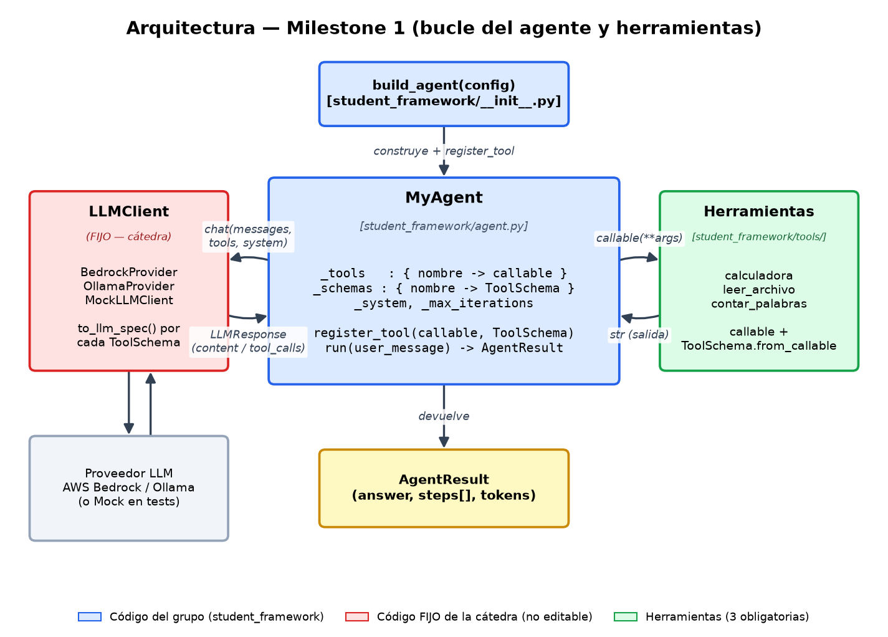
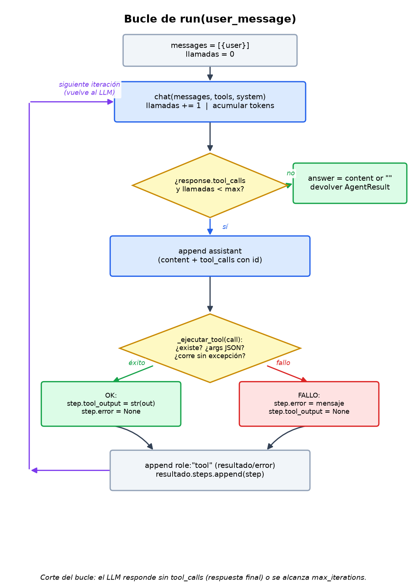

# Arquitectura y diagramas — Milestone 1

Este documento explica en detalle los dos diagramas de la carpeta `docs/`. Es el
acompañamiento de las imágenes; la explicación completa de la entrega (decisiones
de diseño, herramientas, pruebas, etc.) está en
[`INFORME_M1.md`](../INFORME_M1.md), en la raíz del repo.

- **Diagrama 1 — Arquitectura de componentes:** `arquitectura_m1.png`
- **Diagrama 2 — Flujo del bucle `run()`:** `bucle_run_m1.png`

Ambas imágenes se generan con scripts reproducibles (matplotlib):

```bash
python scripts/generar_diagrama_arquitectura.py   # -> docs/arquitectura_m1.png
python scripts/generar_diagrama_bucle.py          # -> docs/bucle_run_m1.png
```

> matplotlib NO es dependencia de la entrega: se instala aparte solo para
> regenerar las imágenes. En el repo se versionan los PNG y los scripts.

---

## Diagrama 1 — Arquitectura de componentes



### Convención de colores

| Color | Significado |
|---|---|
| 🟦 Azul | Código del grupo (`student_framework/`) |
| 🟥 Rojo | Código **FIJO** de la cátedra (`mia_agents/`, no editable) |
| 🟩 Verde | Las 3 herramientas obligatorias |

### Componentes (las cajas)

- **`build_agent(config)`** — `student_framework/__init__.py`. Único punto de
  entrada público. Construye el `MyAgent`, le inyecta el `LLMClient` (el del
  `config["llm_client"]` si lo hay, o uno del entorno con `from_env()`) y registra
  las tres herramientas. Tanto la CLI como los tests de conformidad entran por acá.

- **`MyAgent`** — `student_framework/agent.py`. El corazón del framework. Guarda:
  - `_tools`: diccionario `nombre → callable` (para **ejecutar** la herramienta).
  - `_schemas`: diccionario `nombre → ToolSchema` (para **ofrecer** la herramienta
    al LLM).
  - `_system`, `_max_iterations`: prompt de sistema y tope de iteraciones.

  Expone `register_tool(callable, ToolSchema)` y `run(user_message) -> AgentResult`.

- **`LLMClient` (FIJO)** — `mia_agents/llm_client.py`. Abstrae el proveedor:
  `BedrockProvider`, `OllamaProvider` o el `MockLLMClient` de los tests. Recibe los
  `ToolSchema` y los traduce al formato nativo de cada proveedor con
  `to_llm_spec()`. **El agente nunca habla con el proveedor directamente**, solo
  con esta interfaz; por eso los tests pueden sustituirlo por un mock.

- **Herramientas** — `student_framework/tools/`. Una por archivo: `calculadora`,
  `leer_archivo`, `contar_palabras`. Cada una es un `callable` tipado + su
  `ToolSchema` derivado con `ToolSchema.from_callable(fn)`.

- **`AgentResult`** — el objeto que devuelve `run`: `answer` (texto final),
  `steps` (un `AgentStep` por herramienta invocada) y los contadores de tokens.

### Relaciones (las flechas)

| Flecha | Qué representa |
|---|---|
| `build_agent → MyAgent` (*construye + register_tool*) | La fábrica crea el agente y le registra las tools |
| `MyAgent → LLMClient` (*chat(messages, tools, system)*) | El agente consulta al LLM pasándole los esquemas |
| `LLMClient → MyAgent` (*LLMResponse: content / tool_calls*) | El LLM responde con texto final o con pedidos de tool |
| `MyAgent → Herramientas` (*callable(\*\*args)*) | El agente ejecuta la tool pedida con sus argumentos |
| `Herramientas → MyAgent` (*str salida*) | La tool devuelve su resultado como string |
| `LLMClient ↔ Proveedor` | Traducción a Bedrock/Ollama (o mock en tests) |
| `MyAgent → AgentResult` (*devuelve*) | El resultado final del `run` |

### Idea clave

El agente solo intercambia con el `LLMClient` objetos **normalizados**
(`messages`, `tools`, `LLMResponse`). Toda la traducción específica de cada
proveedor vive dentro del `LLMClient` (que es FIJO). Esto es lo que permite
inyectar un `MockLLMClient` en los tests sin tocar una línea del agente.

---

## Diagrama 2 — Flujo del bucle `run()`



El diagrama muestra, paso a paso, qué hace `run(user_message)`:

1. **Inicio.** Se arma `messages = [{user}]` y `llamadas = 0`.

2. **Llamada al LLM** (caja azul). `chat(messages, tools, system)`; se incrementa
   `llamadas` y se acumulan los tokens reportados.

3. **Decisión** (rombo): *¿hay `response.tool_calls` y `llamadas < max`?*
   - **NO →** `answer = content or ""` y se devuelve el `AgentResult`. **Fin.**
     Esta es la condición de parada del M1: el LLM respondió sin pedir
     herramientas (o se agotó el presupuesto de iteraciones).
   - **SÍ →** se sigue al paso 4.

4. **Registrar el turno del assistant** (caja azul): se agrega a `messages` el
   mensaje `assistant` con sus `tool_calls` (incluyendo el `id` de cada llamada,
   necesario para correlacionar en Bedrock).

5. **Ejecutar cada herramienta** (rombo `_ejecutar_tool`): valida que la tool
   exista, que los argumentos sean JSON válido y la corre dentro de un `try`.
   - **Éxito →** `step.tool_output = str(salida)`, `step.error = None`.
   - **Fallo →** `step.error = mensaje`, `step.tool_output = None`.

6. **Volcado común** (caja gris): se agrega un mensaje `role:"tool"` con el
   resultado (o el error) y se registra el `AgentStep` en `resultado.steps`.

7. **Siguiente iteración** (flecha violeta): se vuelve al paso 2 con el historial
   actualizado, para que el LLM observe el resultado y decida cómo continuar.

### Garantías del bucle

- **Sin bucles infinitos:** se hacen como máximo `max_iterations` llamadas al LLM
  (por defecto 10).
- **`run` nunca lanza excepción:** los tres modos de fallo de una herramienta
  (inexistente, JSON inválido, excepción del callable) se capturan en
  `_ejecutar_tool` y se reportan en `AgentStep.error`.
- **El error vuelve al LLM:** así el modelo puede recuperarse en el siguiente
  turno (probado en `tests/test_escenarios_propios.py`).

> El detalle de las decisiones de diseño detrás de estas garantías (D1–D10) está
> en la sección 6 de [`INFORME_M1.md`](../INFORME_M1.md).
